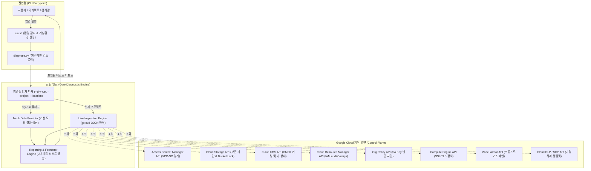

<!--
Copyright 2026 Google LLC. All Rights Reserved.
SPDX-License-Identifier: Apache-2.0

NOTICE: This code/repository is owned by Google LLC and provided under the Apache-2.0 License.
It is strictly provided as an EXAMPLE/REFERENCE ONLY and is NOT INTENDED FOR PRODUCTION USE.
All contents, designs, and code examples are subject to change, modification, or removal at any time without notice.

[고지 사항] 본 저장소 및 문서는 구글 (Google LLC) 소유이며 Apache 2.0 라이선스 하에 예시 (Sample) 용도로 제공된다.
프로덕션 환경용이 아니며, 사전 통지 없이 언제든지 수정, 변경 또는 삭제될 수 있다.
-->

# 기술 상세 설계서 (TDD: Technical Design Document)
## 프로젝트명: Korea FSI Regulatory Perimeter Guard for Gen AI

**문서 버전**: 1.0.0  
**작성 일자**: 2026-09-10  
**상태**: 승인 완료 (Approved)  
**구현 모듈**: `diagnose.py`, `run.sh`

---

## 1. 시스템 아키텍처 개요 및 설계 원칙

### 1.1 설계 목표
본 도구는 대한민국 금융권의 엄격한 클라우드 보안 컴플라이언스(전자금융거래법, 전자금융감독규정, 신용정보법)를 Google Cloud 환경에서 자동 검증하기 위한 **경량 진단 엔진(Lightweight Diagnostic Engine)**이다.

### 1.2 핵심 설계 원칙
1. **투트랙(Two-track) 실행 모델**: CLI 기반 핵심 파이썬 스크립트(`diagnose.py`)와 Cloud Shell 원클릭 실행 래퍼(`run.sh`)의 결합.
2. **비파괴적 읽기 전용 스캔(Non-Destructive Read-Only Scan)**: 모든 GCP 리소스에 대해 `describe`, `list`, `get` 조회 명령만 수행하여 운영 환경에 100% 무해함.
3. **완전 독립형 모의 실행(`--dry-run`)**: 실제 GCP 인증이나 IAM 권한이 없는 환경에서도 결정론적(Deterministic) 모의 진단 데이터를 반환하여 빠른 데모 및 검증 보장.
4. **선언적 처방(Prescriptive Remediation)**: 결격 항목(FAIL/WARN) 식별 시 관리자가 즉시 복구할 수 있는 표준 `gcloud` CLI 명령어를 1:1 매핑하여 출력.

---

## 2. 시스템 아키텍처 및 데이터 흐름도



---

## 3. 모듈 및 컴포넌트 설계

### 3.1 CLI 인자 파서 (`parse_args`)
- `-p`, `--project`: 대상 GCP 프로젝트 ID (미지정 시 활성 gcloud 프로젝트 자동 감지).
- `-l`, `--location`: 점검 대상 리전 (기본값: `asia-northeast3`).
- `-b`, `--audit-bucket`: 감사 로그 및 입출력 저장 대상 버킷명.
- `-k`, `--kms-key`: 검증 대상 CMEK 키 리소스 경로.
- `--dry-run`: 실제 API 호출 없이 모의 감사 데이터 실행.

### 3.2 서브프로세스 래퍼 (`run_gcloud_json`)
- 모든 gcloud 명령어를 `subprocess.run(..., capture_output=True, text=True, check=True)`로 안전하게 격리 실행.
- `--format=json` 인자를 강제하여 파이썬 딕셔너리로 역직렬화.
- 비정상 종료 시 예외를 포획하고 `None`을 반환하여 전체 진단 프로세스가 중단되지 않도록 안전장치(Fail-Safe) 마련.

### 3.3 리포트 포매터 (`print_report`)
- 9개 항목의 상태를 `[PASS]`, `[WARN]`, `[FAIL]`로 분류.
- 총 통제 항목 수 대비 충족, 주의, 미달 건수 요약 통계 집계.
- 결격 항목 발생 시 `규제 요건` 및 `조치 권고`를 2줄 들여쓰기로 명확히 시각화.
- 미달 항목(`FAIL`) 존재 시 프로세스 종료 코드 `1`을 반환하여 CI/CD 파이프라인 연동 지원.

---

## 4. 9대 기술 통제 세부 구현 명세 (Functional Requirements)

| 요구사항 ID | 점검 명칭 | 실행 명령어 | 판정 알고리즘 (Evaluation Logic) |
| :--- | :--- | :--- | :--- |
| **FR-01** | VPC-SC 보안 경계 | `gcloud access-context-manager perimeters list --format=json` | 프로젝트 번호/ID가 포함된 서비스 경계의 `restrictedServices` 목록에 `aiplatform.googleapis.com`이 포함되어 있으면 PASS, 아니면 FAIL. |
| **FR-02** | 웹 검색 Grounding 격리 | 아키텍처 정적 분석 | VPC-SC 내부에서 `web_search_tool` 호출 시 Egress 차단 위험을 경고하고 DMZ 프로젝트 분리 구조를 WARN으로 권고. |
| **FR-03** | Cloud Storage 5년 보존 | `gcloud storage buckets describe gs://<BUCKET> --format=json` | `retention_policy.retention_period >= 157680000` (5년) 이고 `retention_policy.is_locked == true` 이면 PASS, 잠금 미설정 시 WARN, 기간 미달/미설정 시 FAIL. |
| **FR-04** | 고객 관리 암호화 키 | `gcloud storage buckets describe gs://<BUCKET> --format=json` | `encryption.default_kms_key_name` 속성이 존재하고 활성화된 Cloud KMS 키와 일치하면 PASS, Google 기본 키면 FAIL. |
| **FR-05** | 데이터 접근 감사 로그 | `gcloud projects get-iam-policy <PROJECT> --format=json` | `auditConfigs` 내 `allServices` 또는 `aiplatform.googleapis.com`의 `auditLogConfigs`에 `DATA_READ`와 `DATA_WRITE`가 모두 포함되어 있으면 PASS, 아니면 FAIL. |
| **FR-06** | Model Armor 가드레일 | `gcloud beta model-armor templates list --location=<LOC> --format=json` | 대상 리전에 활성화된 Model Armor 템플릿이 1개 이상 존재하면 PASS, 없으면 FAIL. |
| **FR-07** | SDP 가명처리 템플릿 | `gcloud dlp inspect-templates list --location=<LOC> --format=json` | 대상 리전에 DLP 검사 템플릿이 존재하면 PASS, 없으면 WARN. |
| **FR-08** | 서비스 계정 키 발급 차단 | `gcloud resource-manager org-policies describe constraints/iam.disableServiceAccountKeyCreation --project=<PROJECT> --format=json` | 정책 규칙의 `spec.rules`에 `enforce: true`가 설정되어 있으면 PASS, 아니면 FAIL. |
| **FR-09** | 전송 구간 TLS 1.2+ 암호화 | `gcloud compute ssl-policies list --project=<PROJECT> --format=json` | `minTlsVersion`이 `TLS_1_2` 또는 `TLS_1_3`으로 설정된 커스텀 SSL 정책이 식별되면 PASS, 없으면 WARN. |

---

## 5. 보안 및 권한 설계 (Security & IAM Matrix)

본 도구를 실행하기 위해 진단 실행 주체(사용자 계정 또는 서비스 계정)에 요구되는 최소 IAM 권한은 다음과 같다:

```
roles/accesscontextmanager.reader  -> accesscontextmanager.perimeters.list
roles/compute.viewer               -> compute.sslPolicies.list
roles/dlp.inspectTemplatesReader   -> dlp.inspectTemplates.list
roles/logging.viewer               -> logging.views.access
roles/orgpolicy.policyViewer       -> orgpolicy.policies.get, orgpolicy.policies.list
roles/storage.admin                -> storage.buckets.get, storage.buckets.getIamPolicy
```

---

## 6. 비기능 설계 및 검증 전략 (Non-Functional Requirements)

| 요구사항 ID | 분류 | 세부 설계 및 검증 방법 |
| :--- | :--- | :--- |
| **NFR-01** | 비파괴성 (Zero Risk) | 모든 GCP 호출을 읽기 전용(`describe`, `list`, `get`)으로 제한하여 기존 리소스 변경 없음 보장. |
| **NFR-02** | 모의 실행 (Dry-run) | 외부 네트워크 의존성 없이 `python3 diagnose.py --dry-run`으로 9개 항목 무결성 1초 내 시뮬레이션. |
| **NFR-03** | 실행 성능 | 전체 9개 항목의 실측 검사를 10초 이내에 완료할 수 있도록 경량 gcloud CLI 호출 최적화. |
| **NFR-04** | 민감 정보 비식별화 | 실제 고객 사명, 프로젝트 ID, 내부 도메인 등의 하드코딩 배제 및 가명 템플릿 변수 표준화. |
