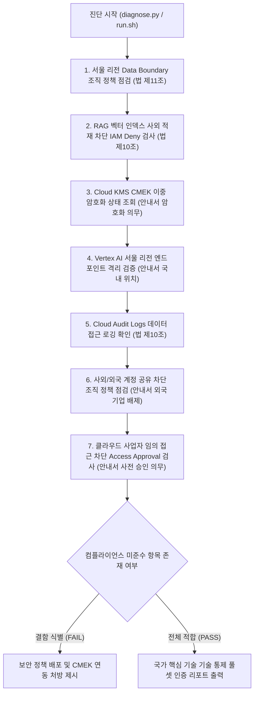

<!--
Copyright 2026 Google LLC. All Rights Reserved.
SPDX-License-Identifier: Apache-2.0

NOTICE: This code/repository is owned by Google LLC and provided under the Apache-2.0 License.
It is strictly provided as an EXAMPLE/REFERENCE ONLY and is NOT INTENDED FOR PRODUCTION USE.
All contents, designs, and code examples are subject to change, modification, or removal at any time without notice.

[고지 사항] 본 저장소 및 문서는 구글 (Google LLC) 소유이며 Apache 2.0 라이선스 하에 예시 (Sample) 용도로 제공된다.
프로덕션 환경용이 아니며, 사전 통지 없이 언제든지 수정, 변경 또는 삭제될 수 있다.
-->

> [!IMPORTANT]
> **구글 (Google LLC) 참조용 샘플 고지 사항**:
> 본 프로젝트의 모든 소스 코드와 문서는 Google LLC의 소유이며, Apache-2.0 라이선스에 따라 오직 **참조용 샘플 (Sample / Reference Only)** 목적으로만 제공된다. 프로덕션 환경에 그대로 사용할 수 없으며, 사전 통지 없이 언제든 내용이 수정, 변경 또는 삭제될 수 있다.

# 국가 핵심 기술(NCT) 생성형 AI 보안 통제 및 데이터 주권 진단기

대한민국 산업기술의 유출방지 및 보호에 관한 법률(산업기술보호법) 및 산업통상자원부 「국가 핵심 기술 클라우드 컴퓨팅 서비스 이용을 위한 보안 관리 안내서」에 따라, 국가 핵심 기술(NCT) 취급 기업이 생성형 인공 지능 워크로드를 도입할 때 요구되는 **7대 핵심 기술적 통제(Technical Controls) 전수(Full-Set)**를 체계적으로 종합 점검하고 불법 기술 수출 및 데이터 유출 리스크를 효과적으로 예방하는 진단 도구다. (As of 2026-09-10)

**Audience**: `#Architect`, `#Compliance`, `#SecOps`  
**Concern**: `#Compliance`, `#IAM`, `#Resilience`, `#Security`  
**Service**: `#CloudIAM`, `#CloudKMS`, `#CloudStorage`, `#ResourceManager`, `#VertexAI`

---

## 1. 진단 대상 7대 보안 통제 항목

본 도구는 산업기술보호법 및 산자부 「국가 핵심 기술 클라우드 컴퓨팅 보안 관리 안내서」에 따른 7대 기술적 통제를 전수 점검한다. 세부 법적 요건 및 상세 구현 명세는 [비즈니스 요구 사항 명세서 (BRD.md)](docs/BRD.md) 및 [기술 상세 설계서 (TDD.md)](docs/TDD.md)에 상세히 기술되어 있다.

| 요구 사항 ID | 통제 영역 | 점검 핵심 내용 |
| :--- | :--- | :--- |
| **FR-01** | 물리적 국내 위치 | `gcp.resourceLocations` 서울 리전 생성 강제 (법 제11조) |
| **FR-02** | 사외 유출 차단 | RAG 벡터 데이터 저장 차단 IAM Deny 정책 (법 제10조) |
| **FR-03** | 이중 암호화 의무 | Cloud KMS CMEK 이중 암호화 및 서울 키링 연동 (안내서 제2장) |
| **FR-04** | 국내 격리 추론 | 추론 리전 국소화 (Vertex AI 서울 엔드포인트 격리) |
| **FR-05** | 감사 추적 | Cloud Audit Logs 데이터 접근(DATA_READ/WRITE) 로깅 (법 제10조) |
| **FR-06** | 외국 기업 배제 | 사외/외국 계정 공유 차단 (`iam.allowedPolicyMemberDomains`) |
| **FR-07** | 제공자 임의 접근 차단 | 클라우드 제공자 접근 승인/투명성 (Access Approval) |

---

## 2. 진단 및 해결 흐름



---

## 3. 사전 준비 사항

본 도구를 실행하려면 최소 아래의 IAM 권한이 필요하다:

| 서비스 | 필요 역할(Role) | 최소 IAM 권한 | 필요 사유 |
| :--- | :--- | :--- | :--- |
| `Access Approval` | `roles/accessapproval.viewer` | `accessapproval.settings.get` | CSP 임의 접근 사전 승인 설정 조회 |
| `Cloud IAM` | `roles/iam.securityReviewer` | `iam.denyPolicies.get`, `iam.denyPolicies.list` | RAG 벡터 저장 차단 IAM Deny 확인 (법 제10조) |
| `Cloud KMS` | `roles/cloudkms.viewer` | `cloudkms.keyRings.list`, `cloudkms.cryptoKeys.list` | 서울 리전 CMEK 이중 암호화 키링 상태 조회 (안내서 기준) |
| `Logging` | `roles/logging.viewer` | `logging.views.access` | Cloud Audit Logs 데이터 접근 감사 로깅 조회 (법 제10조) |
| `Resource Manager` | `roles/orgpolicy.policyViewer` | `orgpolicy.policies.list`, `orgpolicy.constraints.list` | 리소스 위치 및 외부 도메인 차단 조직 정책 조회 (법 제11조) |

---

## 4. 퀵스타트

### 가상 실행 (Dry-run)

실제 GCP API 호출이나 권한 없이도 모의 감사 점검을 즉시 시뮬레이션할 수 있다:

```bash
# 저장소 클론 및 이동
git clone https://github.com/jiangjun-forge/google-cloud-0-to-1.git
cd google-cloud-0-to-1/samples/korea-nct-gen-ai-compliance-checker

# 모의 실행
./run.sh --dry-run
```

### 실제 환경 실행

```bash
# 기본 활성 프로젝트 대상 서울 리전 기준 진단
./run.sh

# 특정 프로젝트 및 특정 리전 지정 실행
./run.sh --project=my-nct-project --region=asia-northeast3
```

---

## 5. 결과 출력 예시

```text
=====================================================================================
국가 핵심 기술(NCT) 대상 생성형 AI 보안 통제 및 데이터 주권 진단 리포트
진단 모드: 가상 실행 (Dry-run)
대상 프로젝트: demo-nct-compliance-project | 점검 리전: asia-northeast3 (서울)
=====================================================================================

[항목별 기술적 보안 통제 준수 현황]
-------------------------------------------------------------------------------------
ID    | 보안 통제 항목              | 상태   | 현황 및 규제 요건
-------------------------------------------------------------------------------------
FR-01 | 물리적 국내 위치 (법 제11조)  | PASS | 서울 리전(asia-northeast3) 생성 제한 적용 완료
FR-02 | RAG 벡터 사외 저장 차단     | FAIL | aiplatform.indexes.* 차단 Deny Policy 미설정
FR-03 | Cloud KMS CMEK 이중 암호화  | FAIL | 기본 구글 관리 키 사용 중 (KMS CMEK 미연동)
FR-04 | 추론 리전 국소화 (Vertex AI) | PASS | Vertex AI 서울 엔드포인트 사용 강제 확인
FR-05 | 데이터 접근 감사 로그       | PASS | DATA_READ, DATA_WRITE 감사 로그 활성화 상태
FR-06 | 사외/외국 계정 공유 차단    | FAIL | iam.allowedPolicyMemberDomains 조직 정책 미적용
FR-07 | 제공자 임의 접근 사전 승인  | PASS | Access Approval 정상 활성화 확인
-------------------------------------------------------------------------------------
진단 결과: 총 7개 항목 중 PASS 4건, FAIL 3건 (미준수 항목 즉각 조치 필요)
=====================================================================================
```

---

## 6. 결과 확인 후 즉각 조치 가이드

1. **조직 정책 리소스 위치 제약 설정 (산업기술보호법 제11조 기술 수출 승인/신고 의무)**:
   - 해외 리전(us-central1 등) 생성을 차단하여 승인 없는 해외 기술 이전 리스크를 방어한다.
   - 리소스 위치 정의 ( https://cloud.google.com/resource-manager/docs/organization-policy/defining-locations )
   - 대한민국 Data Boundary 패키지 ( https://cloud.google.com/assured-workloads/docs/control-packages/south-korea-data-boundary )
2. **사외/외국 기업 계정 공유 차단 (보안 관리 안내서 외국 기업 접근 배제)**:
   - 승인된 사내 Google Workspace 도메인 외 계정으로의 IAM 바인딩을 차단한다.
   ```bash
   # constraints/iam.allowedPolicyMemberDomains 설정 적용
   gcloud resource-manager org-policies set-policy policy.yaml --project=$PROJECT_ID
   ```
3. **클라우드 제공자 임의 접근 통제 (보안 관리 안내서 사전 승인 의무)**:
   - 구글 엔지니어의 장애 지원 접근 시 고객 사전 승인을 강제한다.
   ```bash
   gcloud access-approval settings update --project=$PROJECT_ID --enrolled-services=all-services
   ```
4. **Cloud KMS CMEK 키 관리 (보안 관리 안내서 이중 암호화 의무)**:
   - 국내 키링에 고객 관리 암호화 키를 생성하고 모든 버킷 및 데이터셋에 연동하여 CSP의 데이터 접근 통제권을 확보한다.
   - Cloud KMS 콘솔 ( https://console.cloud.google.com/security/kms )

---

## 7. 자원 정리 (Teardown) 가이드

본 진단 도구는 환경 설정을 조회하는 읽기 전용 스크립트이므로 별도의 클라우드 리소스를 생성하지 않는다. 테스트용으로 생성한 Cloud KMS 키링이나 IAM Deny 정책은 아래 명령어로 삭제하거나 폐기한다:

```bash
# 테스트용 IAM Deny 정책 삭제
gcloud iam deny-policies delete nct-rag-deny --attachment-point=cloudresourcemanager.googleapis.com/projects/PROJECT_ID

# Cloud KMS 키 버전 비활성화 및 파기 예약
gcloud kms keys versions destroy 1 --key=nct-cmek-key --keyring=nct-keyring --location=asia-northeast3
```

---

## 8. 관련 규격 문서

- [비즈니스 요구 사항 명세서 (BRD.md)](docs/BRD.md)
- [기술 상세 설계서 (TDD.md)](docs/TDD.md)
