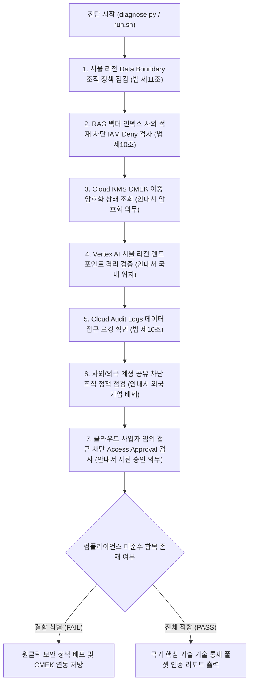

<!--
Copyright 2026 Google LLC. All Rights Reserved.
SPDX-License-Identifier: Apache-2.0

NOTICE: This code/repository is owned by Google LLC and provided under the Apache-2.0 License.
It is strictly provided as an EXAMPLE/REFERENCE ONLY and is NOT INTENDED FOR PRODUCTION USE.
All contents, designs, and code examples are subject to change, modification, or removal at any time without notice.

[고지 사항] 본 저장소 및 문서는 구글 (Google LLC) 소유이며 Apache 2.0 라이선스 하에 예시 (Sample) 용도로 제공된다.
프로덕션 환경용이 아니며, 사전 통지 없이 언제든지 수정, 변경 또는 삭제될 수 있다.
-->

> [!IMPORTANT]
> **구글 (Google LLC) 참조용 샘플 고지 사항**:
> 본 프로젝트의 모든 소스 코드와 문서는 Google LLC의 소유이며, Apache-2.0 라이선스에 따라 오직 **참조용 샘플 (Sample / Reference Only)** 목적으로만 제공된다. 프로덕션 환경에 그대로 사용할 수 없으며, 사전 통지 없이 언제든 내용이 수정, 변경 또는 삭제될 수 있다.

# 국가 핵심 기술(NCT) 생성형 AI 보안 통제 및 데이터 주권 진단기

대한민국 산업기술의 유출방지 및 보호에 관한 법률(산업기술보호법) 및 산업통상자원부 「국가핵심기술 클라우드 컴퓨팅 서비스 이용을 위한 보안관리 안내서」에 따라, 국가 핵심 기술(NCT) 취급 기업이 생성형 인공 지능 워크로드를 도입할 때 요구되는 **7대 핵심 기술적 통제(Technical Controls) 전수(Full-Set)**를 1클릭으로 종합 점검하고 불법 기술 수출 및 데이터 유출 리스크를 원천 예방하는 진단 도구다. (As of 2026-09-10)

**Audience**: `#Architect`, `#Compliance`, `#SecOps`  
**Concern**: `#Compliance`, `#IAM`, `#Resilience`, `#Security`  
**Service**: `#CloudIAM`, `#CloudKMS`, `#CloudStorage`, `#ResourceManager`, `#VertexAI`

---

## 1. 규제 수용 범위 및 법적 근거 사실 관계

산업통상자원부 및 한국산업기술보호협회(KAITS)의 보안 관리 체계는 관리적 통제와 기술적 통제로 구분된다. 본 진단 도구는 **클라우드 인프라 아키텍처 관점에서 자동 검증 가능한 기술적 통제 7대 기둥 전수(Full-Set)**를 다룬다:

| 통제 영역 | 법적/안내서 근거 조항 | 본 도구 점검 항목 (7대 기술 통제 풀셋) | 자동 검증 방식 |
| :--- | :--- | :--- | :--- |
| **물리적 국내 위치** | 산업기술보호법 제11조, 안내서 제1장 | `NCT-SEC-01`: `gcp.resourceLocations` 서울 리전 강제 | 리소스 생성 위치 조직 정책 검증 |
| **사외 유출 차단** | 산업기술보호법 제10조, 안내서 제3장 | `NCT-SEC-02`: RAG 벡터 데이터 저장 차단 (IAM Deny) | `aiplatform.indexes.*` IAM Deny 검증 |
| **이중 암호화 의무** | 보안관리 안내서 제2장 (암호화 통제) | `NCT-SEC-03`: Cloud KMS CMEK 이중 암호화 (Dual Encryption) | 서울 리전 KMS 키링 및 버킷 CMEK 바인딩 확인 |
| **국내 격리 추론** | 보안관리 안내서 제1장 (시스템 위치) | `NCT-SEC-04`: 추론 리전 국소화 (Vertex AI 서울 엔드포인트) | `asia-northeast3-aiplatform` 엔드포인트 격리 확인 |
| **감사 추적** | 산업기술보호법 제10조 (접근 기록) | `NCT-SEC-05`: Cloud Audit Logs 데이터 접근(DATA_READ/WRITE) 로깅 | 감사 로그 싱크 및 접근 로그 수집 검증 |
| **외국 기업 배제** | 보안관리 안내서 제3장 (외국 기업 통제) | `NCT-SEC-06`: 사외/외국 계정 공유 차단 (`iam.allowedPolicyMemberDomains`) | 사내 승인 도메인 외 계정 바인딩 원천 차단 확인 |
| **제공자 임의 접근 차단** | 보안관리 안내서 제2장 (접근 승인 의무) | `NCT-SEC-07`: 클라우드 제공자 접근 승인/투명성 (Access Approval) | CSP 엔지니어 사전 승인 강제 설정 검증 |

> [!NOTE]
> **관리적·물리적 통제와의 역할 분담**:
> 본 도구는 기술적 인프라 통제(Technical Controls)를 완벽하게 검증한다. 단, 산업통상자원부 장관 대상 사전 수출 승인/신고 행정 절차, 연구원 보안 서약서 징구, 사업장 물리적 보호구역 출입 통제 등 관리적 통제(Administrative Controls)는 기업 내부 법무/보안 절차로 구비되어야 한다.

---

## 2. 진단 및 해결 흐름



---

## 3. 사전 준비 사항

본 도구를 실행하려면 최소 아래의 IAM 권한이 필요하다:

| 서비스 | 필요 역할(Role) | 최소 IAM 권한 | 필요 사유 |
| :--- | :--- | :--- | :--- |
| `Access Approval` | `roles/accessapproval.viewer` | `accessapproval.settings.get` | CSP 임의 접근 사전 승인 설정 조회 |
| `Cloud IAM` | `roles/iam.securityReviewer` | `iam.denyPolicies.get`, `iam.denyPolicies.list` | RAG 벡터 저장 차단 IAM Deny 확인 (법 제10조) |
| `Cloud KMS` | `roles/cloudkms.viewer` | `cloudkms.keyRings.list`, `cloudkms.cryptoKeys.list` | 서울 리전 CMEK 이중 암호화 키링 상태 조회 (안내서 기준) |
| `Logging` | `roles/logging.viewer` | `logging.views.access` | Cloud Audit Logs 데이터 접근 감사 로깅 조회 (법 제10조) |
| `Resource Manager` | `roles/orgpolicy.policyViewer` | `orgpolicy.policies.list`, `orgpolicy.constraints.list` | 리소스 위치 및 외부 도메인 차단 조직 정책 조회 (법 제11조) |

---

## 4. 1분 퀵스타트

### 가상 실행 (Dry-run)

실제 GCP API 호출이나 권한 없이도 모의 감사 점검을 즉시 시뮬레이션할 수 있다:

```bash
# 저장소 클론 및 이동
git clone https://github.com/jiangjun-forge/google-cloud-0-to-1.git
cd google-cloud-0-to-1/samples/korea-nct-gen-ai-compliance-checker

# 모의 실행
./run.sh --dry-run
```

### 실제 환경 실행

```bash
# 기본 활성 프로젝트 대상 서울 리전 기준 진단
./run.sh

# 특정 프로젝트 및 특정 리전 지정 실행
./run.sh --project=my-nct-project --region=asia-northeast3
```

---

## 5. 결과 출력 예시

```text
=====================================================================================
국가 핵심 기술(NCT) 대상 생성형 AI 보안 통제 및 데이터 주권 진단 리포트
진단 모드: 가상 실행 (Dry-run)
대상 프로젝트: demo-nct-compliance-project
지정 리전: asia-northeast3 (대한민국 서울 리전)
=====================================================================================

[항목별 기술적 보안 통제 준수 현황]
-------------------------------------------------------------------------------------
구분                 보안 통제 항목                                                     상태     현재 상태
-------------------------------------------------------------------------------------
Data Residency     gcp.resourceLocations (조직 정책 - 법 제11조)                       PASS     서울 리전(asia-northeast3)으로 리소스 생성 제한 적용 완료
Vector Security    RAG 벡터 데이터 저장 차단 (IAM Deny - 법 제10조)                    FAIL     aiplatform.indexes.* 권한 차단 Deny Policy 미발견
Encryption         Cloud KMS CMEK 이중 암호화 (안내서 필수 요건)                      FAIL     기본 구글 관리 키 사용 중 (KMS CMEK 미연동 버킷 2개 감지)
Inference Boundary 추론 리전 국소화 (Vertex AI - 안내서 국내 위치)                    PASS     Vertex AI 서울 리전 엔드포인트(asia-northeast3-aiplatform.googleapis.com) 사용 강제 확인
Audit Logging      Cloud Audit Logs 데이터 접근 로깅 (법 제10조)                       PASS     DATA_READ, DATA_WRITE 감사 로그 활성화 상태
Access Control     사외/외국 계정 공유 차단 (조직 정책 - 안내서 외국 기업 접근 배제)   FAIL     iam.allowedPolicyMemberDomains 조직 정책 미적용 (외부 계정 초대 위험 존재)
Provider Isolation 클라우드 제공자 임의 접근 통제 (Access Approval - 안내서 사전 승인 의무) PASS     Access Approval 및 Access Transparency 정상 활성화 (CSP 엔지니어 사전 승인 강제)
-------------------------------------------------------------------------------------

[진단 종합 점수: 총 7개 항목 중 PASS 4건, FAIL 3건]

[미준수 항목 긴급 조치 가이드]
1. RAG 벡터 데이터 저장 차단 (IAM Deny - 법 제10조)
   - 조치 방향: gcloud iam deny-policies create 명령으로 벡터 인덱스 사외 생성 차단 정책 적용 필요
2. Cloud KMS CMEK 이중 암호화 (안내서 필수 요건)
   - 조치 방향: 서울 리전 Cloud KMS 키링 및 암호화 키 생성 후 GCS/BigQuery CMEK 지정 (이중 암호화 의무 준수)
3. 사외/외국 계정 공유 차단 (조직 정책 - 안내서 외국 기업 접근 배제)
   - 조치 방향: gcloud resource-manager org-policies set-policy 명령으로 사내 승인 도메인만 허용 (기술 해외 유출 원천 차단)

[표준 보안 처방 CLI 명령어]
1. 서울 리전 Data Boundary 조직 정책 강제 (불법 해외 기술 이전 방지):
   gcloud resource-manager org-policies enable-enforce constraints/gcp.resourceLocations --project=demo-nct-compliance-project
2. RAG 벡터 데이터 저장 차단 Deny Policy 배포:
   gcloud iam deny-policies create nct-rag-deny --attachment-point=cloudresourcemanager.googleapis.com/projects/demo-nct-compliance-project --file=deny-rules.json
3. 서울 리전 Cloud KMS CMEK 키 생성 (이중 암호화):
   gcloud kms keyrings create nct-keyring --location=asia-northeast3 --project=demo-nct-compliance-project
   gcloud kms keys create nct-cmek-key --keyring=nct-keyring --location=asia-northeast3 --purpose=encryption --project=demo-nct-compliance-project
4. 사외 승인 도메인 외 계정 바인딩 원천 차단:
   gcloud resource-manager org-policies set-policy policy.yaml --project=demo-nct-compliance-project
=====================================================================================
```

---

## 6. 결과 확인 후 즉각 조치 가이드

1. **조직 정책 리소스 위치 제약 설정 (산업기술보호법 제11조 기술 수출 승인/신고 의무)**:
   - 해외 리전(us-central1 등) 생성을 원천 차단하여 승인 없는 해외 기술 이전 리스크를 방어한다.
   - [리소스 위치 정의](https://cloud.google.com/resource-manager/docs/organization-policy/defining-locations)
   - [대한민국 Data Boundary 패키지](https://cloud.google.com/assured-workloads/docs/control-packages/south-korea-data-boundary)
2. **사외/외국 기업 계정 공유 차단 (보안관리 안내서 외국 기업 접근 배제)**:
   - 승인된 사내 Google Workspace 도메인 외 계정으로의 IAM 바인딩을 원천 차단한다.
   ```bash
   # constraints/iam.allowedPolicyMemberDomains 설정 적용
   gcloud resource-manager org-policies set-policy policy.yaml --project=$PROJECT_ID
   ```
3. **클라우드 제공자 임의 접근 통제 (보안관리 안내서 사전 승인 의무)**:
   - 구글 엔지니어의 장애 지원 접근 시 고객 사전 승인을 강제한다.
   ```bash
   gcloud access-approval settings update --project=$PROJECT_ID --enrolled-services=all-services
   ```
4. **Cloud KMS CMEK 키 관리 (보안관리 안내서 이중 암호화 의무)**:
   - 국내 키링에 고객 관리 암호화 키를 생성하고 모든 버킷 및 데이터셋에 연동하여 CSP의 데이터 접근 통제권을 확보한다.
   - [Cloud KMS 콘솔](https://console.cloud.google.com/security/kms)

---

## 7. 자원 정리 (Teardown) 가이드

본 진단 도구는 환경 설정을 조회하는 읽기 전용 스크립트이므로 별도의 클라우드 리소스를 생성하지 않는다. 테스트용으로 생성한 Cloud KMS 키링이나 IAM Deny 정책은 아래 명령어로 삭제하거나 폐기한다:

```bash
# 테스트용 IAM Deny 정책 삭제
gcloud iam deny-policies delete nct-rag-deny --attachment-point=cloudresourcemanager.googleapis.com/projects/PROJECT_ID

# Cloud KMS 키 버전 비활성화 및 파기 예약
gcloud kms keys versions destroy 1 --key=nct-cmek-key --keyring=nct-keyring --location=asia-northeast3
```
