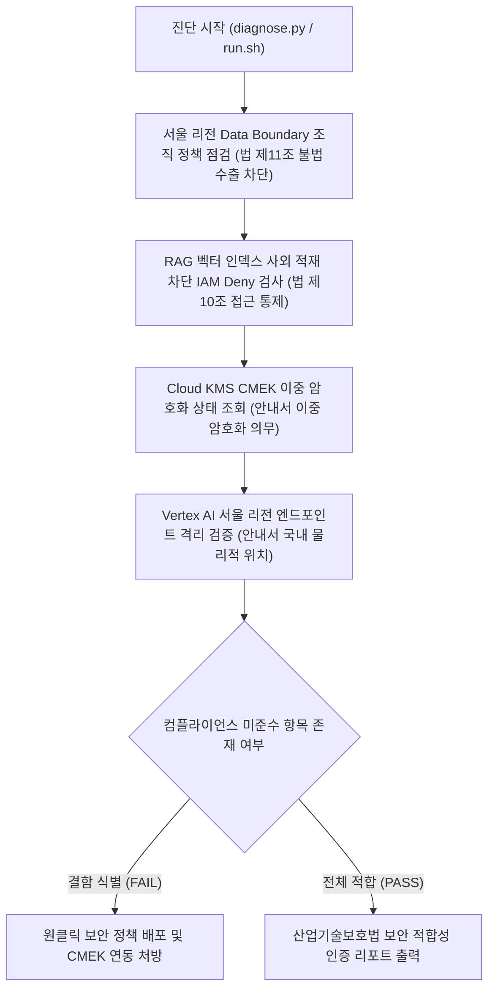

<!--
Copyright 2026 Google LLC. All Rights Reserved.
SPDX-License-Identifier: Apache-2.0

NOTICE: This code/repository is owned by Google LLC and provided under the Apache-2.0 License.
It is strictly provided as an EXAMPLE/REFERENCE ONLY and is NOT INTENDED FOR PRODUCTION USE.
All contents, designs, and code examples are subject to change, modification, or removal at any time without notice.

[고지 사항] 본 저장소 및 문서는 구글 (Google LLC) 소유이며 Apache 2.0 라이선스 하에 예시 (Sample) 용도로 제공된다.
프로덕션 환경용이 아니며, 사전 통지 없이 언제든지 수정, 변경 또는 삭제될 수 있다.
-->

> [!IMPORTANT]
> **구글 (Google LLC) 참조용 샘플 고지 사항**:
> 본 프로젝트의 모든 소스 코드와 문서는 Google LLC의 소유이며, Apache-2.0 라이선스에 따라 오직 **참조용 샘플 (Sample / Reference Only)** 목적으로만 제공된다. 프로덕션 환경에 그대로 사용할 수 없으며, 사전 통지 없이 언제든 내용이 수정, 변경 또는 삭제될 수 있다.

# 국가 핵심 기술(NCT) 생성형 AI 보안 통제 및 데이터 주권 진단기

대한민국 산업기술의 유출방지 및 보호에 관한 법률(산업기술보호법) 및 산업통상자원부 「국가핵심기술 클라우드 컴퓨팅 서비스 이용을 위한 보안관리 안내서」에 따라, 국가 핵심 기술(NCT) 취급 기업이 생성형 인공 지능 워크로드를 도입할 때 요구되는 서울 리전 데이터 상주(Data Residency), 해외 리전 무단 이전에 따른 불법 기술 수출 차단, 이용자 고유 키 기반 이중 암호화(Cloud KMS CMEK), RAG 벡터 무단 적재 방지(IAM Deny)를 종합 점검하는 보안 감사 진단 도구다. (As of 2026-09-10)

**Audience**: `#Architect`, `#Compliance`, `#SecOps`  
**Concern**: `#Compliance`, `#IAM`, `#Resilience`, `#Security`  
**Service**: `#CloudIAM`, `#CloudKMS`, `#CloudStorage`, `#ResourceManager`, `#VertexAI`

---

## 1. 법적 근거 및 규제 프레임워크 사실 관계

본 도구는 현행 대한민국 산업기술보호 법령 및 주무 부처 지침에 정의된 조항에 근거하여 인프라를 진단한다:

1. **산업기술의 유출방지 및 보호에 관한 법률 제2조 제2호(국가핵심기술의 정의)**:
   - 반도체, 디스플레이, 이차전지, 자동차, 철강, 조선 등 해외로 유출될 경우 국가 안보 및 국민 경제에 중대한 악영향을 줄 우려가 있어 산업통상자원부 장관이 지정한 산업기술을 의미한다.
2. **산업기술의 유출방지 및 보호에 관한 법률 제10조(국가핵심기술의 관리 등)**:
   - 국가 핵심 기술 보유 기관은 보호 구역 설정, 출입 통제, 암호화, 불법 유출 방지 조치 등 기술적, 물리적 보안 대책을 의무적으로 수립하고 이행하여야 한다.
3. **산업기술의 유출방지 및 보호에 관한 법률 제11조(국가핵심기술의 수출 등의 승인 등)**:
   - 국가 핵심 기술을 외국 기업에 제공하거나 해외로 이전하는 행위는 **"기술 수출"**로 규정된다.
   - 정부 R&D 지원으로 개발된 기술은 **산업통상자원부 장관의 수출 승인**, 자체 개발 기술은 **사전 수출 신고**가 필수적이다.
   - 퍼블릭 클라우드의 해외 리전(us-central1 등)에 설계 도면, 소스 코드, AI 학습 데이터 및 가중치를 무단 저장하는 행위는 무허가 불법 기술 수출(제36조 형사 처벌 대상)로 간주될 수 있다.
4. **산업통상자원부 및 한국산업기술보호협회 「국가핵심기술 클라우드 컴퓨팅 서비스 이용을 위한 보안관리 안내서」**:
   - **물리적 위치 국내 한정 원칙**: 국가 핵심 기술 관련 데이터, 클라우드 시스템, 백업 데이터 및 운영 인력은 원칙적으로 물리적으로 국내에 위치하여야 한다. (Google Cloud 대한민국 서울 리전 `asia-northeast3` 한정)
   - **이용자 고유 키 기반 이중 암호화 의무**: 이용자가 자체 관리하는 고유 키(CMEK)로 1차 암호화하고 CSP가 2차 암호화하는 이중 암호화(Dual Encryption) 체계를 구축하여, 클라우드 제공자의 평문 접근을 원천 배제하여야 한다.
   - **접근 통제 및 비인가 유출 차단**: 외국 기업 인력 및 비인가 계정의 접근을 배제하고, RAG 벡터 인덱스 등의 사외 무단 저장을 조직 정책(IAM Deny)으로 차단하여야 한다.
   - **접근 기록 보존**: 데이터 접근 및 처리 감사 로그(DATA_READ, DATA_WRITE)를 실시간 기록하고 보존하여야 한다.

---

## 2. 진단 및 해결 흐름



---

## 3. 사전 준비 사항

본 도구를 실행하려면 최소 아래의 IAM 권한이 필요하다:

| 서비스 | 필요 역할(Role) | 최소 IAM 권한 | 필요 사유 |
| :--- | :--- | :--- | :--- |
| `Cloud IAM` | `roles/iam.securityReviewer` | `iam.denyPolicies.get`, `iam.denyPolicies.list` | RAG 벡터 저장 차단 및 외국 계정 거부 정책 확인 (법 제10조) |
| `Cloud KMS` | `roles/cloudkms.viewer` | `cloudkms.keyRings.list`, `cloudkms.cryptoKeys.list` | 서울 리전 CMEK 이중 암호화 키링 상태 조회 (안내서 기준) |
| `Resource Manager` | `roles/orgpolicy.policyViewer` | `orgpolicy.policies.list`, `orgpolicy.constraints.list` | gcp.resourceLocations 서울 리전 강제 여부 조회 (법 제11조) |
| `Logging` | `roles/logging.viewer` | `logging.views.access` | Cloud Audit Logs 데이터 접근 감사 로깅 조회 (법 제10조) |

---

## 4. 1분 퀵스타트

### 가상 실행 (Dry-run)

실제 GCP API 호출이나 권한 없이도 모의 감사 점검을 즉시 시뮬레이션할 수 있다:

```bash
# 저장소 클론 및 이동
git clone https://github.com/jiangjun-forge/google-cloud-0-to-1.git
cd google-cloud-0-to-1/samples/korea-nct-gen-ai-compliance-checker

# 모의 실행
./run.sh --dry-run
```

### 실제 환경 실행

```bash
# 기본 활성 프로젝트 대상 서울 리전 기준 진단
./run.sh

# 특정 프로젝트 및 특정 리전 지정 실행
./run.sh --project=my-nct-project --region=asia-northeast3
```

---

## 5. 결과 출력 예시

```text
=====================================================================================
국가 핵심 기술(NCT) 대상 생성형 AI 보안 통제 및 데이터 주권 진단 리포트
진단 모드: 가상 실행 (Dry-run)
대상 프로젝트: demo-nct-compliance-project
지정 리전: asia-northeast3 (대한민국 서울 리전)
=====================================================================================

[항목별 기술적 보안 통제 준수 현황]
-------------------------------------------------------------------------------------
구분                 보안 통제 항목                                    상태     현재 상태
-------------------------------------------------------------------------------------
Data Residency     gcp.resourceLocations (조직 정책 - 법 제11조)      PASS     서울 리전(asia-northeast3)으로 리소스 생성 제한 적용 완료
Vector Security    RAG 벡터 데이터 저장 차단 (IAM Deny - 법 제10조)   FAIL     aiplatform.indexes.* 권한 차단 Deny Policy 미발견
Encryption         Cloud KMS CMEK 이중 암호화 (안내서 필수 요건)     FAIL     기본 구글 관리 키 사용 중 (KMS CMEK 미연동 버킷 2개 감지)
Inference Boundary 추론 리전 국소화 (Vertex AI - 안내서 국내 위치)   PASS     Vertex AI 서울 리전 엔드포인트(asia-northeast3-aiplatform.googleapis.com) 사용 강제 확인
Audit Logging      Cloud Audit Logs 데이터 접근 로깅 (법 제10조)      PASS     DATA_READ, DATA_WRITE 감사 로그 활성화 상태
-------------------------------------------------------------------------------------

[진단 종합 점수: 총 5개 항목 중 PASS 3건, FAIL 2건]

[미준수 항목 긴급 조치 가이드]
1. RAG 벡터 데이터 저장 차단 (IAM Deny)
   - 조치 방향: gcloud iam deny-policies create 명령으로 미승인 벡터 인덱스 생성 차단 정책 적용 필요 (산업기술 사외 유출 방지)
2. Cloud KMS CMEK 이중 암호화
   - 조치 방향: 서울 리전 Cloud KMS 키링 및 암호화 키 생성 후 GCS/BigQuery CMEK 지정 (보안관리 안내서 이중 암호화 요건 준수)

[표준 보안 처방 CLI 명령어]
1. 서울 리전 Data Boundary 조직 정책 강제 (불법 해외 기술 이전 방지):
   gcloud resource-manager org-policies enable-enforce constraints/gcp.resourceLocations --project=demo-nct-compliance-project
2. RAG 벡터 데이터 저장 차단 Deny Policy 배포:
   gcloud iam deny-policies create nct-rag-deny --attachment-point=cloudresourcemanager.googleapis.com/projects/demo-nct-compliance-project --file=deny-rules.json
3. 서울 리전 Cloud KMS CMEK 키 생성 (이중 암호화):
   gcloud kms keyrings create nct-keyring --location=asia-northeast3 --project=demo-nct-compliance-project
   gcloud kms keys create nct-cmek-key --keyring=nct-keyring --location=asia-northeast3 --purpose=encryption --project=demo-nct-compliance-project
=====================================================================================
```

---

## 6. 결과 확인 후 즉각 조치 가이드

1. **조직 정책 리소스 위치 제약 설정 (산업기술보호법 제11조 기술 수출 승인/신고 의무)**:
   - 해외 리전(us-central1 등) 생성을 원천 차단하여 승인 없는 해외 기술 이전 리스크를 방어한다.
   - [리소스 위치 정의](https://cloud.google.com/resource-manager/docs/organization-policy/defining-locations)
   - [대한민국 Data Boundary 패키지](https://cloud.google.com/assured-workloads/docs/control-packages/south-korea-data-boundary)
2. **IAM Deny Policy 구성 (산업기술보호법 제10조 기술적 보호 조치)**:
   - 미승인 계정 및 RAG 벡터 인덱스 생성 권한을 원천 차단하여 사외 유출을 방지한다.
   - [IAM 거부 정책 콘솔](https://console.cloud.google.com/iam-admin/deny-policies)
   - [IAM 거부 정책 개요](https://cloud.google.com/iam/docs/deny-overview)
3. **Cloud KMS CMEK 키 관리 (보안관리 안내서 이중 암호화 의무)**:
   - 국내 키링에 고객 관리 암호화 키를 생성하고 모든 버킷 및 데이터셋에 연동하여 CSP의 데이터 접근 통제권을 확보한다.
   - [Cloud KMS 콘솔](https://console.cloud.google.com/security/kms)
   - [고객 관리 암호화 키(CMEK)](https://cloud.google.com/kms/docs/cmek)

---

## 7. 자원 정리 (Teardown) 가이드

본 진단 도구는 환경 설정을 조회하는 읽기 전용 스크립트이므로 별도의 클라우드 리소스를 생성하지 않는다. 테스트용으로 생성한 Cloud KMS 키링이나 IAM Deny 정책은 아래 명령어로 삭제하거나 폐기한다:

```bash
# 테스트용 IAM Deny 정책 삭제
gcloud iam deny-policies delete nct-rag-deny --attachment-point=cloudresourcemanager.googleapis.com/projects/PROJECT_ID

# Cloud KMS 키 버전 비활성화 및 파기 예약
gcloud kms keys versions destroy 1 --key=nct-cmek-key --keyring=nct-keyring --location=asia-northeast3
```
