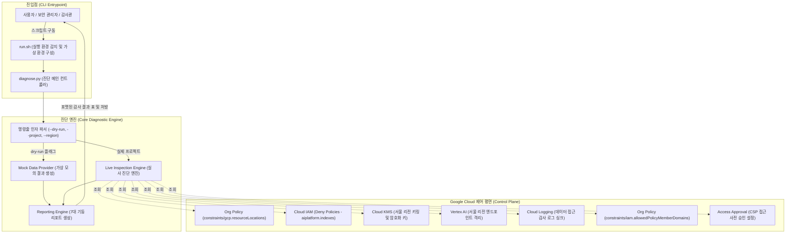

<!--
Copyright 2026 Google LLC. All Rights Reserved.
SPDX-License-Identifier: Apache-2.0

NOTICE: This code/repository is owned by Google LLC and provided under the Apache-2.0 License.
It is strictly provided as an EXAMPLE/REFERENCE ONLY and is NOT INTENDED FOR PRODUCTION USE.
All contents, designs, and code examples are subject to change, modification, or removal at any time without notice.

[고지 사항] 본 저장소 및 문서는 구글 (Google LLC) 소유이며 Apache 2.0 라이선스 하에 예시 (Sample) 용도로 제공된다.
프로덕션 환경용이 아니며, 사전 통지 없이 언제든지 수정, 변경 또는 삭제될 수 있다.
-->

# 기술 상세 설계서 (TDD: Technical Design Document)
## 프로젝트명: Korea National Core Technology (NCT) Gen AI Compliance Checker

---

## 1. 시스템 아키텍처 개요 및 설계 원칙

### 1.1 설계 목표
본 도구는 산업기술의 유출방지 및 보호에 관한 법률(산업기술보호법) 및 산업통상자원부·한국산업기술보호협회 「국가 핵심 기술 클라우드 컴퓨팅 서비스 이용을 위한 보안 관리 안내서」에 명시된 **7대 핵심 기술적 통제(Technical Controls)**를 Google Cloud 환경에서 자동 감사하고 복구 명령어를 처방하는 **경량 진단 엔진(Lightweight Diagnostic Engine)**이다.

### 1.2 핵심 설계 원칙
1. **투트랙(Two-track) 실행 모델**: 독립 실행형 파이썬 스크립트(`diagnose.py`)와 Cloud Shell 및 터미널 환경 자동 감지 래퍼(`run.sh`)의 결합을 통해 무설치 단일 명령 실행을 지원한다.
2. **비파괴적 읽기 전용 스캔(Non-Destructive Read-Only Scan)**: 리소스의 설정 상태만 조회(`describe`, `list`, `get`)하며, 클라우드 인프라 자원을 임의로 생성, 변경, 삭제하지 않아 운영 환경에 영향을 주지 않고 안전하다.
3. **완전 독립형 모의 실행(`--dry-run`)**: 실제 GCP 인증 정보나 관리자 IAM 권한이 없는 데모 또는 개발 환경에서도 결정론적(Deterministic) 가상 진단 데이터를 제공하여 사전 기능 검증을 보장한다.
4. **선언적 처방(Prescriptive Remediation)**: 결격 항목(FAIL/WARN) 발생 시 산자부 안내서 기준에 부합하는 정규 `gcloud` 복구 명령어를 즉시 매핑하여 관리자의 즉각적인 조치를 지원한다.

---

## 2. 시스템 아키텍처 및 데이터 흐름도



---

## 3. 모듈 및 컴포넌트 설계

### 3.1 CLI 인자 파서 (`parse_args`)
- `-p`, `--project`: 대상 GCP 프로젝트 ID (미지정 시 활성 gcloud 계정 기본 프로젝트 자동 감지).
- `-r`, `--region`: 점검 대상 국내 리전 (기본값: `asia-northeast3` 대한민국 서울).
- `--dry-run`: 실제 API 호출 없이 모의 감사 데이터로 가상 실행.

### 3.2 프로젝트 ID 탐지기 (`detect_project_id`)
- 사용자 입력 인자, 환경 변수(`PROJECT_ID`), gcloud 활성 프로젝트 순서로 식별.
- 식별 실패 시 가상 프로젝트 ID(`demo-nct-compliance-project`)를 폴백으로 할당하여 예외 중단 방지.

### 3.3 서브프로세스 래퍼 (`run_gcloud_json`)
- 모든 gcloud 명령어를 `subprocess.run(..., capture_output=True, text=True, check=True)`로 안전하게 격리 실행.
- `--format=json` 인자를 적용하여 JSON 형식으로 수신한 뒤 파이썬 객체로 역직렬화.
- API 비활성화, 권한 부족, 리소스 부재 시 예외를 포획하고 `None`을 반환하여 전체 검사가 중단되지 않는 Fail-Safe 설계 적용.

### 3.4 실사 점검 엔진 (`inspect_live_environment`)
- 7대 보안 통제 영역별 전용 gcloud CLI 명령어를 순차 실행.
- 응답 데이터에서 산자부 가이드라인 핵심 속성을 추출하여 `PASS`, `WARN`, `FAIL` 상태를 판정.

### 3.5 리포트 엔진 (`main`)
- 7대 통제 항목의 점검 결과를 표(Table) 형태로 렌더링.
- 합격(PASS), 주의(WARN), 미달(FAIL) 건수를 집계하고 종합 준수율을 산출.
- 미달 항목에 대한 법적 근거 기반 조치 방향 및 즉시 실행 가능한 정규 CLI 처방 스크립트 출력.

---

## 4. 7대 기술 통제 세부 구현 명세 (Functional Requirements)

| 요구 사항 ID | 점검 영역 | 점검 명령어 | 판정 알고리즘 (Evaluation Logic) |
| :--- | :--- | :--- | :--- |
| **FR-01** | 물리적 국내 위치 | `gcloud resource-manager org-policies describe constraints/gcp.resourceLocations --project=<PROJECT> --format=json` | 정책 규칙의 `spec.rules`에 서울 리전(`asia-northeast3`) 허용 제약이 존재하면 PASS, 다른 리전 허용 또는 미설정 시 FAIL. |
| **FR-02** | RAG 벡터 유출 차단 | `gcloud iam deny-policies list --attachment-point=cloudresourcemanager.googleapis.com/projects/<PROJECT> --format=json` | 프로젝트에 적용된 IAM Deny 정책 목록이 1개 이상 존재하고 활성화되어 있으면 PASS, 미설정 시 FAIL. |
| **FR-03** | KMS CMEK 이중 암호화 | `gcloud kms keyrings list --location=<REGION> --project=<PROJECT> --format=json` | 대상 서울 리전에 활성화된 Cloud KMS 키링 및 암호화 키가 1개 이상 식별되면 PASS, 구글 기본 키 사용 시 FAIL. |
| **FR-04** | 추론 리전 국소화 | `gcloud config get-value api_endpoint_overrides/aiplatform` | API 엔드포인트 오버라이드 값이 서울 리전(`asia-northeast3-aiplatform.googleapis.com`)을 가리키면 PASS, 기본 글로벌 엔드포인트 참조 가능성 존재 시 WARN. |
| **FR-05** | 데이터 접근 감사 로그 | `gcloud logging sinks list --project=<PROJECT> --format=json` | 구성된 Cloud Logging 싱크가 1개 이상 존재하여 감사 로그 외부 안전 격리 보관이 설정되어 있으면 PASS, 없으면 FAIL. |
| **FR-06** | 사외/외국 계정 배제 | `gcloud resource-manager org-policies describe constraints/iam.allowedPolicyMemberDomains --project=<PROJECT> --format=json` | 정책 규칙의 `spec.rules`에 사내 승인된 Google Workspace 고객 ID 목록 제약이 설정되어 있으면 PASS, 미설정 시 FAIL. |
| **FR-07** | CSP 임의 접근 차단 | `gcloud access-approval settings get --project=<PROJECT> --format=json` | `enrolledServices`에 서비스가 등록되어 Google 엔지니어 접근 시 사전 고객 승인을 강제하면 PASS, 미등록 또는 비활성화 시 WARN. |

---

## 5. 보안 및 권한 설계 (Security & IAM Matrix)

진단 실행 주체(사용자 계정 또는 CI/CD 서비스 계정)에 요구되는 최소 IAM 권한 매트릭스는 다음과 같다:

```
roles/orgpolicy.policyViewer       -> orgpolicy.policies.get, orgpolicy.policies.list
roles/iam.securityReviewer          -> iam.denyPolicies.list, iam.denyPolicies.get
roles/cloudkms.viewer               -> cloudkms.keyRings.list, cloudkms.cryptoKeys.list
roles/logging.viewer                -> logging.sinks.list
roles/accessapproval.viewer         -> accessapproval.settings.get
```

---

## 6. 비기능 설계 및 검증 전략 (Non-Functional Requirements)

| 요구 사항 ID | 분류 | 세부 설계 및 검증 방법 |
| :--- | :--- | :--- |
| **NFR-01** | 비파괴성 (안전성 확보) | 모든 검사를 조회 명령으로 제한하여 운영 환경에 영향을 주지 않고 안전함. |
| **NFR-02** | 모의 실행 (Dry-run) | 외부 네트워크 및 GCP 인증 없이 `python3 diagnose.py --dry-run`으로 7개 항목을 신속하게 시뮬레이션. |
| **NFR-03** | 실행 성능 | 7개 핵심 항목의 실사 점검을 지연 없이 신속하게 완료할 수 있도록 경량 CLI 호출 최적화. |
| **NFR-04** | 민감 정보 비식별화 | 특정 기업의 기밀 및 도메인 정보 하드코딩 배제 및 가명 템플릿 표준화. |
