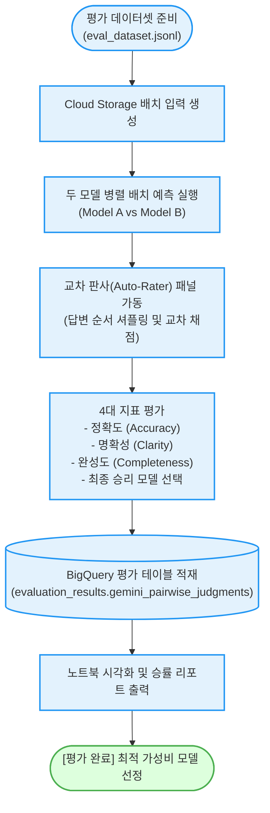

# LLM 페어와이즈 배치 자동 평가기 (`llm-pairwise-autorater`)

대규모 질문 데이터셋에 대해 두 LLM 모델의 출력을 병렬 배치 추론하고, 교차 판사 모델을 통해 **정확도, 명확성, 완성도 및 승률(Win-rate)을 자동 채점하여 BigQuery에 누적 적재 및 시각화**하는 엔터프라이즈 평가 도구다.

**Audience**: `#Architect`, `#Developer`  
**Concern**: `#Performance`, `#Resilience`  
**Date**: `2026-09-09`  
**Service**: `#BigQuery`, `#CloudStorage`, `#GeminiAPI`, `#VertexAI`

---

## 이 가이드가 필요한 상황 (증상 체크리스트)

- **신구 모델 성능 비교(A/B 테스트)**: Gemini 2.5 Pro와 Gemini 2.5 Flash 간의 응답 품질 및 비용 대비 효용성을 수백 개 이상의 실전 질문으로 블라인드 평가하고자 할 때
- **판사 모델 편향(Bias) 방지**: LLM 판사가 특정 모델(예: 더 긴 답변이나 특정 순서)을 편애하는 현상을 막기 위해 순서를 셔플링하고 교차 패널 판사를 가동하고자 할 때
- **시각화 및 통계 분석 필요**: 평가 결과 차트, 승률 분포, 상세 판정 근거(Rationale)를 주피터 노트북(`llm_pairwise_autorater.ipynb`)에서 인터랙티브하게 분석하고자 할 때

---

## 평가 및 채점 흐름 (Activity Diagram)



---

## 사전 준비 사항 (필요 권한 - IAM)

배치 작업 실행, 스토리지 버킷 및 BigQuery 적재를 위한 IAM 역할이다:

| 역할 (Role) | 권한 ID | 용도 |
| :--- | :--- | :--- |
| **Vertex AI 사용자** | `roles/aiplatform.user` | 배치 예측 작업 생성 및 모델 호출 |
| **Storage 객체 관리자** | `roles/storage.objectAdmin` | Cloud Storage 평가 입출력 파일 저장 |
| **BigQuery 데이터 편집자** | `roles/bigquery.dataEditor` | 평가 결과 테이블 생성 및 데이터 적재 |

---

## 1분 퀵스타트 (실행 방법)

### 방법 1: 구글 클라우드 쉘 (Google Cloud Shell) - *가장 권장*

```bash
# 1. 저장소 클론 및 폴더 이동
git clone https://github.com/jiangjun-forge/google-cloud-0-to-1.git
cd google-cloud-0-to-1/samples/llm-pairwise-autorater

# 2. 사전 가상 체험 또는 데모 모드 (배치 실행 없이 가상 결과 표 확인)
./run.sh --dry-run

# 3. 기존 BigQuery 누적 평가 결과만 빠르게 확인
./run.sh --report-only

# 4. 실제 평가 실행
./run.sh -p your-project-id --model-a gemini-2.5-flash --model-b gemini-2.5-pro
```

### 방법 2: 주피터 노트북 기반 심층 분석 (`llm_pairwise_autorater.ipynb`)

데이터 분석 및 시각화 차트 조회가 필요한 경우, 본 폴더 내에 포함된 [`llm_pairwise_autorater.ipynb`](./llm_pairwise_autorater.ipynb)를 주피터 랩 또는 구글 콜랩(Google Colab)에서 열어 단계별로 실행한다.

---

## 결과 출력 예시

스크립트가 완료되면 아래와 같이 **모델별 상세 지표 점수 및 승률 순위 표**가 출력된다:

```text
========================================================================
[진단 결과] LLM 페어와이즈(Pairwise) 오토레이터 벤치마크 리포트
  - 세션 ID: session_batch_20260909_120000
  - 모델 A : gemini-2.5-flash
  - 모델 B : gemini-2.5-pro
========================================================================

[교차 판사 평가 결과: 정확도, 명확성, 완성도, 최종 승률]
┌───────────────────────┬────────────┬──────────┬──────────┬──────────┬──────────┬────────────┐
│ 모델 식별자 (Model ID)│ 평가 문항수│ 평균정확도│ 평균명확도│ 평균완성도│ 평균 총점│ 최종 승률  │
├───────────────────────┼────────────┼──────────┼──────────┼──────────┼──────────┼────────────┤
│ gemini-2.5-pro        │ 50문항     │ 4.82점   │ 4.75점   │ 4.90점   │ 4.82점   │ 74.0% 승리 │
│ gemini-2.5-flash      │ 50문항     │ 4.31점   │ 4.52점   │ 4.20점   │ 4.34점   │ 26.0% 승리 │
└───────────────────────┴────────────┴──────────┴──────────┴──────────┴──────────┴────────────┘
```

---

## 자원 정리 (Teardown Guide)

평가 완료 후 Cloud Storage 임시 버킷 및 BigQuery 누적 데이터를 정리하려면 아래 명령어를 실행한다:

```bash
# 1. Cloud Storage 임시 배치 파일 삭제
gcloud storage rm --recursive gs://YOUR_PROJECT_ID/batch_*

# 2. BigQuery 평가 데이터세트 삭제
bq rm -r -f -d YOUR_PROJECT_ID:evaluation_results
```
