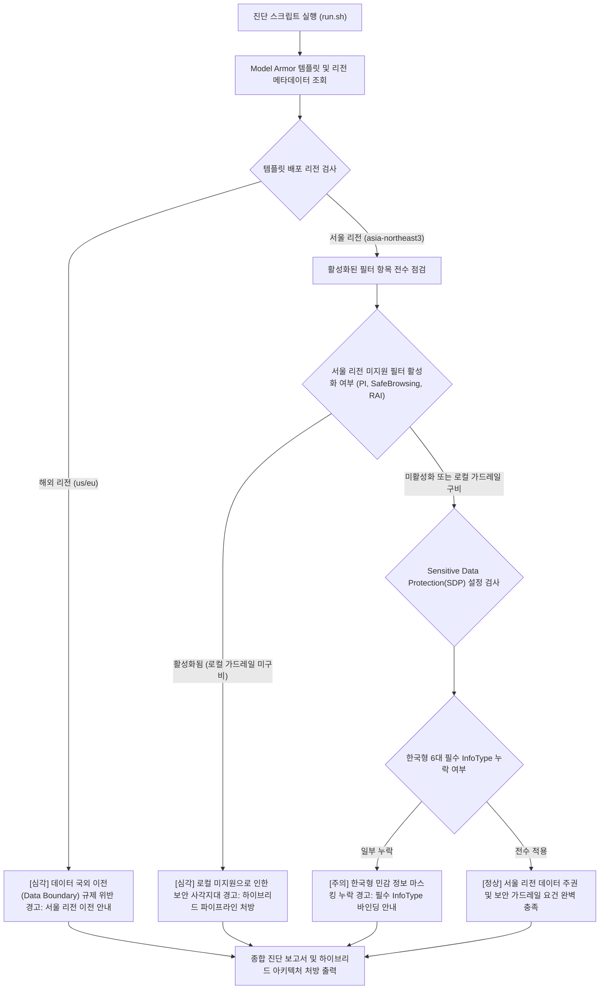

<!--
Copyright 2026 Google LLC. All Rights Reserved.
SPDX-License-Identifier: Apache-2.0

NOTICE: This code/repository is owned by Google LLC and provided under the Apache-2.0 License.
It is strictly provided as an EXAMPLE/REFERENCE ONLY and is NOT INTENDED FOR PRODUCTION USE.
All contents, designs, and code examples are subject to change, modification, or removal at any time without notice.

[고지 사항] 본 저장소 및 문서는 구글 (Google LLC) 소유이며 Apache 2.0 라이선스 하에 예시 (Sample) 용도로 제공된다.
프로덕션 환경용이 아니며, 사전 통지 없이 언제든지 수정, 변경 또는 삭제될 수 있다.
-->

> [!IMPORTANT]
> **구글 (Google LLC) 참조용 샘플 고지 사항**:
> 본 프로젝트의 모든 소스 코드와 문서는 Google LLC의 소유이며, Apache-2.0 라이선스에 따라 오직 **참조용 샘플 (Sample / Reference Only)** 목적으로만 제공된다. 프로덕션 환경에 그대로 사용할 수 없으며, 사전 통지 없이 언제든 내용이 수정, 변경 또는 삭제될 수 있다.

# 서울 리전 Model Armor 기능 제약 및 한국형 가드레일 하이브리드 보완 진단기 (`model-armor-regional-compliance-guard`)

대한민국 서울 리전(asia-northeast3) 환경에서 Model Armor 템플릿의 리전 미지원 필터(프롬프트 인젝션, 악성 URL, RAI)로 인한 보안 사각지대와 데이터 국외 이전 규제 위반 위험을 1분 만에 자동 진단하고, 한국형 개인 정보(Korea-specific InfoTypes) 및 로컬 하이브리드 가드레일 파이프라인 처방을 제공하는 도구다. (As of 2026-09-09)

**Audience**: `#Architect`, `#Compliance`, `#SecOps`  
**Concern**: `#Compliance`, `#Resilience`, `#Security`  
**Service**: `#GeminiAPI`, `#ModelArmor`, `#SensitiveDataProtection`

---

## 1. 문제 증상 체크리스트
- 금융감독원 '혁신 금융 서비스 지정' 또는 국내 개인 정보 보호법 준수를 위해 생성형 AI 데이터 처리를 서울 리전(`asia-northeast3`) 내에서만 완결해야 한다.
- Model Armor 콘솔에서 프롬프트 인젝션(Prompt Injection) 및 악성 URL 차단 필터를 활성화했으나, 서울 리전 로컬 엔진 부재로 인해 실제 검사가 바이패스되거나 해외 리전으로 데이터가 유출될 위험이 존재한다.
- Model Armor는 서울 리전에서 SDP(Sensitive Data Protection)만 정식 지원하므로, 인젝션 방어 및 안전성 필터는 별도의 로컬 가드레일 계층으로 분리해야 함을 사전에 인지하지 못했다.
- SDP 템플릿 설정 시 주민등록번호(`KOREA_RRN`), 여권번호(`KOREA_PASSPORT`), 운전면허번호, 외국인등록번호, 사업자등록번호 등 한국 전용 민감 정보(Korea-specific InfoTypes)가 누락되어 비식별화 처리가 누락된다.

---

## 2. 처리 흐름도



---

## 3. 필요 IAM 권한
- `roles/modelarmor.viewer` (Model Armor 템플릿 읽기 권한)
- `roles/dlp.reader` (Sensitive Data Protection 검사 템플릿 조회)
- 세부 권한:
  - `modelarmor.templates.get`
  - `modelarmor.templates.list`
  - `dlp.inspectTemplates.get`

---

## 4. 원클릭 실행법

### 가상 검증 실행 (--dry-run)
실제 GCP API 호출 없이 사전 정의된 시뮬레이션 데이터를 바탕으로 리전 제약 결함을 즉시 진단한다.
```bash
./run.sh --dry-run
```

### 실제 환경 진단
기본 활성 프로젝트의 서울 리전 Model Armor 템플릿을 점검한다.
```bash
./run.sh --location="asia-northeast3"
```

특정 템플릿을 지정하여 진단할 경우:
```bash
./run.sh --template="ma-template-seoul-finance"
```

결과를 JSON 포맷으로 수집하여 컴플라이언스 감사 시스템과 연동할 경우:
```bash
./run.sh --dry-run --json
```

---

## 5. 결과 확인 후 즉각 조치 가이드
- Model Armor 제품 개요 및 리전 가용성 안내 ( https://cloud.google.com/security/products/model-armor )
- Model Armor 템플릿 구성 공식 가이드 ( https://cloud.google.com/sensitive-data-protection/docs/model-armor-overview )
- Sensitive Data Protection 글로벌 및 로컬 리전 위치 ( https://cloud.google.com/sensitive-data-protection/docs/locations )

### 1. Model Armor 서울 리전 SDP 전용 템플릿 생성
```bash
gcloud beta model-armor templates create ma-template-seoul-hardened \
    --location=asia-northeast3 \
    --filter-config="sdpSettings={inspectTemplate='projects/[PROJECT_ID]/locations/asia-northeast3/inspectTemplates/korea-pii-template'}"
```

### 2. 한국 전용 6대 민감정보(Korea InfoTypes) SDP 템플릿 생성
```bash
gcloud dlp inspect-templates create \
    --location=asia-northeast3 \
    --display-name="korea-pii-template" \
    --info-types=KOREA_RRN,KOREA_PASSPORT,KOREA_DRIVERS_LICENSE_NUMBER,KOREA_ARN,KOREA_BRN,KOREA_NHI_NUMBER
```

### 3. 하이브리드 로컬 가드레일 권고 아키텍처
서울 리전의 Model Armor가 지원하지 않는 프롬프트 인젝션 및 악성 URL 검사는 애플리케이션 수신단에서 로컬 경량 검사 엔진(Regex 패턴 검사기 또는 사내 호스팅 오픈 소스 가드레일 모듈)을 1차 통과시킨 후, Model Armor의 서울 SDP 엔드포인트를 호출하는 투트랙(Two-track) 방어선을 구축한다.

---

## 6. 자원 정리 (Teardown) 안내
본 도구는 읽기 전용 진단 스크립트이므로 자체적으로 리소스를 생성하지 않는다. 테스트 목적으로 생성한 Model Armor 템플릿이나 DLP 템플릿은 다음 명령어로 삭제한다:
```bash
gcloud beta model-armor templates delete [TEMPLATE_NAME] --location=asia-northeast3 --quiet
gcloud dlp inspect-templates delete [DLP_TEMPLATE_NAME] --location=asia-northeast3 --quiet
```
