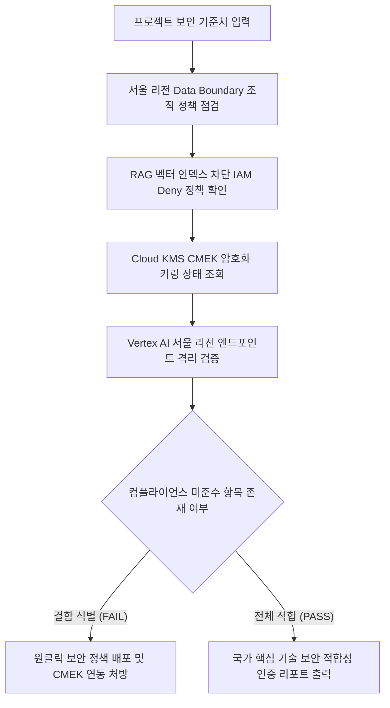

# 국가 핵심 기술(NCT) 생성형 AI 보안 통제 및 데이터 주권 진단기

국가 핵심 기술(NCT) 및 산업 기밀 워크로드 도입 시 요구되는 서울 리전 데이터 보관, RAG 벡터 차단 IAM Deny 정책, Cloud KMS 암호화 통제를 일괄 검증하는 보안 감사 진단 도구다.

`#Audience` `#Architect` `#SecOps`  
`#Concern` `#Compliance` `#Security`  
`#Service` `#CloudIAM` `#CloudKMS` `#CloudStorage` `#VertexAI`

---

## 1. 이 가이드가 필요한 상황

- 국가 핵심 기술(NCT) 또는 방위산업 등 엄격한 국가 보안 규제를 준수하며 생성형 AI(Gemini)를 도입해야 하는 경우
- 비휘발성 데이터(프롬프트, 결과값, 로그, 백업)가 반드시 대한민국 서울 리전(asia-northeast3) 내에만 저장되도록 조직 정책(Org Policy)이 강제되어 있는지 점검할 때
- RAG 벡터 데이터(Embedding, Index)의 사외 저장 또는 무단 적재를 방지하기 위해 IAM Deny 정책이 올바르게 배포되었는지 검증해야 하는 경우
- `Cloud Storage` 및 `BigQuery`의 기본 암호화를 넘어 고객 관리 암호화 키(CMEK) 또는 HYOK 이중 암호화 요건을 충족하는지 감사할 때

---

## 2. 진단 및 해결 흐름



---

## 3. 사전 준비 사항

본 도구를 실행하려면 최소 아래의 IAM 권한이 필요하다:

| 서비스 | 필요 역할(Role) | 최소 IAM 권한 |
| :--- | :--- | :--- |
| `Cloud IAM` | `roles/iam.securityReviewer` | `iam.denyPolicies.get`, `iam.denyPolicies.list` |
| `Cloud KMS` | `roles/cloudkms.viewer` | `cloudkms.keyRings.list`, `cloudkms.cryptoKeys.list` |
| `Resource Manager` | `roles/orgpolicy.policyViewer` | `orgpolicy.policies.list`, `orgpolicy.constraints.list` |

---

## 4. 1분 퀵스타트

### 가상 실행 (Dry-run)

실제 GCP API 호출이나 권한 없이도 모의 감사 점검을 즉시 시뮬레이션할 수 있다:

```bash
./run.sh --dry-run
```

### 실제 환경 실행

```bash
# 기본 활성 프로젝트 대상 서울 리전 기준 진단
./run.sh

# 특정 프로젝트 및 특정 리전 지정 실행
./run.sh --project=my-nct-project --region=asia-northeast3
```

---

## 5. 결과 출력 예시

```text
=====================================================================================
국가 핵심 기술(NCT) 대상 생성형 AI 보안 통제 및 데이터 주권 진단 리포트
진단 모드: 가상 실행 (Dry-run)
대상 프로젝트: demo-nct-compliance-project
지정 리전: asia-northeast3 (대한민국 서울 리전)
=====================================================================================

[항목별 기술적 보안 통제 준수 현황]
-------------------------------------------------------------------------------------
구분                 보안 통제 항목                      상태     현재 상태
-------------------------------------------------------------------------------------
Data Residency     gcp.resourceLocations (조직 정책)   PASS     서울 리전(asia-northeast3)으로 리소스 생성 제한 적용 완료
Vector Security    RAG 벡터 데이터 저장 차단 (IAM Deny) FAIL     aiplatform.indexes.* 권한 차단 Deny Policy 미발견
Encryption         Cloud KMS CMEK 이중 암호화          FAIL     기본 구글 관리 키 사용 중 (KMS CMEK 미연동 버킷 2개 감지)
Inference Boundary 추론 리전 국소화 (Vertex AI)        PASS     Vertex AI 서울 리전 엔드포인트(asia-northeast3-aiplatform.googleapis.com) 사용 강제 확인
Audit Logging      Cloud Audit Logs 데이터 접근 로깅   PASS     DATA_READ, DATA_WRITE 감사 로그 활성화 상태
-------------------------------------------------------------------------------------

[진단 종합 점수: 총 5개 항목 중 PASS 3건, FAIL 2건]

[미준수 항목 긴급 조치 가이드]
1. RAG 벡터 데이터 저장 차단 (IAM Deny)
   - 조치 방향: gcloud iam deny-policies create 명령으로 벡터 인덱스 생성 차단 정책 적용 필요
2. Cloud KMS CMEK 이중 암호화
   - 조치 방향: 서울 리전 Cloud KMS 키링 및 암호화 키 생성 후 GCS/BigQuery CMEK 지정

[표준 보안 처방 CLI 명령어]
1. 서울 리전 Data Boundary 조직 정책 강제:
   gcloud resource-manager org-policies enable-enforce constraints/gcp.resourceLocations --project=demo-nct-compliance-project
2. RAG 벡터 데이터 저장 차단 Deny Policy 배포:
   gcloud iam deny-policies create nct-rag-deny --attachment-point=cloudresourcemanager.googleapis.com/projects/demo-nct-compliance-project --file=deny-rules.json
3. 서울 리전 Cloud KMS CMEK 키 생성:
   gcloud kms keyrings create nct-keyring --location=asia-northeast3 --project=demo-nct-compliance-project
   gcloud kms keys create nct-cmek-key --keyring=nct-keyring --location=asia-northeast3 --purpose=encryption --project=demo-nct-compliance-project
=====================================================================================
```

---

## 6. 결과 확인 후 즉각 조치 가이드

1. **조직 정책 리소스 위치 제약 설정**:
   - 공식 가이드: 리소스 위치 정의 ( https://cloud.google.com/resource-manager/docs/organization-policy/defining-locations )
   - 공식 가이드: 대한민국 Data Boundary 패키지 ( https://cloud.google.com/assured-workloads/docs/control-packages/south-korea-data-boundary )
2. **IAM Deny Policy 구성**:
   - 콘솔 경로: IAM 및 관리자 > 거부 정책 ( https://console.cloud.google.com/iam-admin/deny-policies )
   - 공식 가이드: IAM 거부 정책 개요 ( https://cloud.google.com/iam/docs/deny-overview )
3. **Cloud KMS CMEK 키 관리**:
   - 콘솔 경로: 보안 > 키 관리 ( https://console.cloud.google.com/security/kms )
   - 공식 가이드: 고객 관리 암호화 키(CMEK) ( https://cloud.google.com/kms/docs/cmek )

---

## 7. 자원 정리 (Teardown) 가이드

본 진단 도구는 환경 설정을 조회하는 읽기 전용 스크립트이므로 별도의 클라우드 리소스를 생성하지 않는다. 테스트용으로 생성한 Cloud KMS 키링이나 IAM Deny 정책은 아래 명령어로 삭제하거나 폐기한다:

```bash
# 테스트용 IAM Deny 정책 삭제
gcloud iam deny-policies delete nct-rag-deny --attachment-point=cloudresourcemanager.googleapis.com/projects/PROJECT_ID

# Cloud KMS 키 버전 비활성화 및 파기 예약
gcloud kms keys versions destroy 1 --key=nct-cmek-key --keyring=nct-keyring --location=asia-northeast3
```
