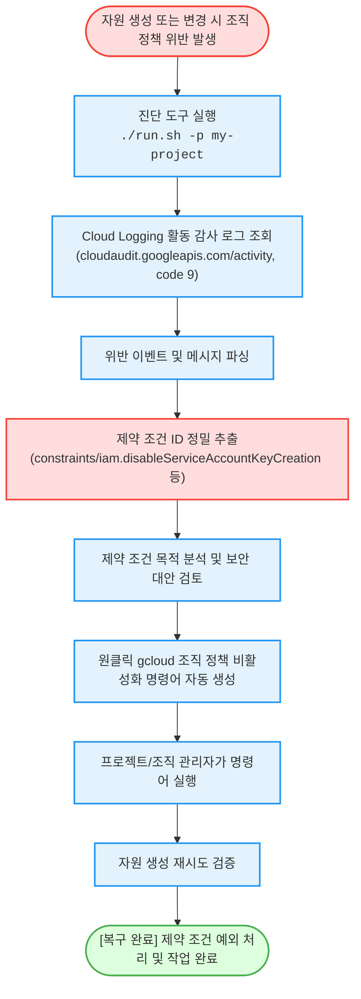

# GCP 조직 정책(Organization Policy) 위반 감사 역추적 및 복구 (`org-policy-resolver`)

GCP 환경에서 자원 생성 또는 권한 변경 시 발생하는 조직 정책 제약 조건(Constraints) 위반 에러를 감사 로그에서 역추적하고, **위반된 제약 조건 ID와 즉시 복구/우회 가능한 gcloud 명령어를 1분 만에 자동 처방**하는 도구다.

**Audience**: `#Architect`, `#SecOps`  
**Concern**: `#Compliance`, `#Security`  
**Date**: `2026-09-09`  
**Service**: `#CloudLogging`, `#ResourceManager`

---

## 이 가이드가 필요한 상황 (증상 체크리스트)

- **자원 생성 중 제약 조건(Constraints) 차단**: VM 인스턴스 외부 IP 할당, 서비스 계정 키 생성, 스토리지 공개 버킷 생성 시 `Failed Precondition (code 9)` 오류와 함께 작업이 거부될 때
- **위반된 정확한 조직 정책 ID 규명**: 에러 메시지가 길거나 복잡하여 정확히 어떤 조직 정책(`constraints/...`)에 걸렸는지 신속히 파악하기 어려울 때
- **테스트/개발 프로젝트 단위의 안전한 정책 해제**: 전사 정책을 훼손하지 않고 해당 프로젝트에 한해 신속히 예외를 적용할 수 있는 `gcloud resource-manager org-policies disable-enforce` 명령어를 즉시 확보하고자 할 때

---

## 진단 및 복구 흐름 (Activity Diagram)



---

## 사전 준비 사항 (필요 권한 - IAM)

감사 로그를 조회하고 조직 정책을 수정하기 위해 필요한 역할 목록이다:

| 역할 (Role) | 권한 ID | 용도 |
| :--- | :--- | :--- |
| **로그 뷰어 (권장)** | `roles/logging.viewer` | Cloud Logging 활동 감사 로그 읽기 |
| **조직 정책 관리자** | `roles/orgpolicy.policyAdmin` | 프로젝트 레벨 조직 정책 제약 조건 비활성화 |

> [!NOTE]
> `--dry-run` 모드로 실행할 경우 별도의 권한 없이도 가상 위반 시나리오와 처방 명령어 형식을 즉시 확인할 수 있다.

---

## 1분 퀵스타트 (실행 방법)

### 방법 1: 구글 클라우드 쉘 (Google Cloud Shell) - *가장 권장*

```bash
# 1. 저장소 클론 및 폴더 이동
git clone https://github.com/jiangjun-forge/google-cloud-0-to-1.git
cd google-cloud-0-to-1/samples/org-policy-resolver

# 2. 사전 가상 체험 또는 데모 모드 (권한 없이 가상 시뮬레이션)
./run.sh --dry-run

# 3. 실제 프로젝트 대상 최근 14일 조직 정책 위반 로그 진단 실행
./run.sh -p your-project-id -d 14
```

### 방법 2: 로컬 환경 (Local Python)

```bash
# 가상 실행
python3 diagnose.py --dry-run

# 실제 실행
python3 diagnose.py --project your-project-id --days 7 --limit 5
```

---

## 결과 출력 예시

스크립트가 완료되면 아래와 같이 **위반 내역과 즉시 복구할 수 있는 복사 가능한 gcloud 명령어**가 출력된다:

```text
========================================================================
[진단 결과] GCP 조직 정책(Organization Policy) 위반 감사 추적 리포트
  - 대상 프로젝트: my-prod-project
  - 조회 기간: 최근 7일
========================================================================

발견된 조직 정책 위반 실패 내역: 3건

[위반 건 #1]
  - 실패 주체 계정  : security-engineer@company.com
  - 요청 대상 서비스: iam.googleapis.com
  - 실행 실패 액션  : google.iam.admin.v1.CreateServiceAccountKey
  - 실제 오류 내용  : Operation denied by organization policy: constraints/iam.disableServiceAccountKeyCreation violated
  [정밀 처방 제약 조건 분석]
    - 검출 제약 사항: constraints/iam.disableServiceAccountKeyCreation
    - 제약 조건 설명: 서비스 계정 키(JSON 키) 신규 생성을 전면 차단하는 조직 제약 조건이다.
    - 권장 임시 방안: 보안을 위해 워크로드 아이덴티티(Workload Identity) 연동을 권장하나, 테스트 및 마이그레이션 단계에서 키 발급이 불가피한 경우 해당 프로젝트에 한해 제약을 해제할 수 있다.
  [즉시 조치 가능한 원클릭 gcloud 해결 명령어]
    gcloud resource-manager org-policies disable-enforce "iam.disableServiceAccountKeyCreation" \
      --project="my-prod-project"
------------------------------------------------------------------------
```

---

## 자원 정리 (Teardown Guide)

본 도구는 순수 감사 로그 조회 도구이며 클라우드 상에 영구 자원을 생성하지 않으므로 별도의 자원 정리 작업이 필요하지 않다.
