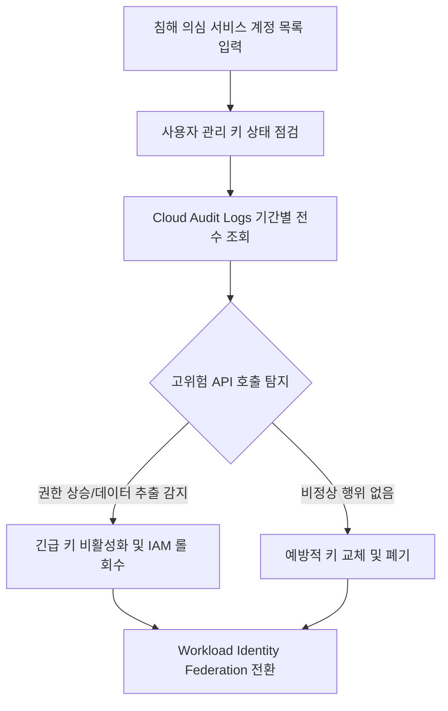

# 서비스 계정 유출 긴급 대응 및 감사 로그 역추적기

유출된 서비스 계정 키의 악용 이력을 Cloud Audit Logs로 전수 추적하고, 위험 키 비활성화 및 Workload Identity Federation 전환을 지원하는 보안 긴급 대응 진단 도구다. (As of 2026-09-09)

**Audience**: `#Architect`, `#SecOps`  
**Concern**: `#Compliance`, `#IAM`, `#Security`  
**Service**: `#BigQuery`, `#CloudAuditLogs`, `#CloudIAM`, `#CloudStorage`

---

## 1. 이 가이드가 필요한 상황

- 깃허브(GitHub) 공개 저장소나 외부 협업 환경에 영구 서비스 계정 키(JSON Key)가 노출된 정황을 접수한 경우
- 사법 기관이나 보안 관제 센터로부터 자격 증명 유출 및 사이버 공격 악용 사실을 통보받은 경우
- 유출된 서비스 계정이 `Cloud Storage`, `BigQuery`, `Cloud IAM` 등 핵심 자원에서 데이터 탈취나 권한 상승을 시도했는지 즉시 확인해야 하는 경우
- 장기 서비스 계정 키를 전면 폐기하고 안전한 Workload Identity Federation 체계로 전환하고자 하는 경우

---

## 2. 진단 및 해결 흐름



---

## 3. 사전 준비 사항

본 도구를 실행하려면 최소 아래의 IAM 권한이 필요하다:

| 서비스 | 필요 역할(Role) | 최소 IAM 권한 |
| :--- | :--- | :--- |
| `Cloud Audit Logs` | `roles/logging.viewer` | `logging.logEntries.list` |
| `Cloud IAM` | `roles/iam.securityReviewer` | `iam.serviceAccountKeys.list`, `resourcemanager.projects.getIamPolicy` |

---

## 4. 1분 퀵스타트

### 가상 실행 (Dry-run)

실제 GCP API 호출이나 권한 없이도 모의 침해 시나리오를 즉시 시뮬레이션할 수 있다:

```bash
./run.sh --dry-run
```

### 실제 환경 실행

```bash
# 기본 활성 프로젝트 및 기본 서비스 계정 대상 실행
./run.sh

# 특정 프로젝트 및 특정 유출 의심 계정 지정 실행
./run.sh --project=my-prod-project --service-accounts="sa1@my-prod-project.iam.gserviceaccount.com,sa2@my-prod-project.iam.gserviceaccount.com" --days=14
```

---

## 5. 결과 출력 예시

```text
================================================================================
유출 의심 서비스 계정 감사 로그 역추적 및 침해 진단 리포트
진단 모드: 가상 실행 (Dry-run)
대상 프로젝트: demo-compromised-investigation
조사 기간: 최근 7일
조사 대상 계정 수: 2개
================================================================================

[1단계] 서비스 계정 활성 키(User-Managed Key) 현황 점검
--------------------------------------------------------------------------------
서비스 계정           키 ID               생성 일자        상태       권장 조치
--------------------------------------------------------------------------------
app-backend-sa   7f8b9c0d1e2f...    2025-11-10   ACTIVE   즉시 비활성화(DISABLE) 및 영구 삭제 권장
app-backend-sa   a1b2c3d4e5f6...    2026-05-15   ACTIVE   침해 의심 시점 생성 키, 즉시 삭제 필요
data-pipeline-sa 7f8b9c0d1e2f...    2025-11-10   ACTIVE   즉시 비활성화(DISABLE) 및 영구 삭제 권장
data-pipeline-sa a1b2c3d4e5f6...    2026-05-15   ACTIVE   침해 의심 시점 생성 키, 즉시 삭제 필요
--------------------------------------------------------------------------------

[2단계] 최근 7일간 Cloud Audit Logs 위험 활동 역추적
--------------------------------------------------------------------------------
발생 시각                    계정              서비스        메서드             호출 IP           위험도
--------------------------------------------------------------------------------
2026-09-09 07:20:00 UTC  app-backend-sa  iam        SetIamPolicy    198.51.100.45   HIGH
  └ 상세 내용: 외부 미인가 계정에 roles/owner 권한 부여 시도 감지
2026-09-09 04:20:00 UTC  data-pipeline-sa storage    get             203.0.113.88    HIGH
  └ 상세 내용: 비정상 해외 IP 대역에서 sensitive-customer-pii 버킷 대량 다운로드
2026-09-08 19:20:00 UTC  app-backend-sa  bigquery   InsertJob       198.51.100.45   HIGH
  └ 상세 내용: 외부 공개 스토리지 버킷으로 결제 및 사용자 테이블 추출 쿼리 실행
2026-09-08 09:20:00 UTC  data-pipeline-sa storage    list            203.0.113.88    MEDIUM
  └ 상세 내용: 사내 백업 버킷 내부 객체 목록 전수 정찰(Enumeration)
2026-09-07 09:20:00 UTC  app-backend-sa  storage    get             192.0.2.10      LOW
  └ 상세 내용: 정상 빌드 파이프라인 버킷 메타데이터 확인

--------------------------------------------------------------------------------
진단 요약: 총 5건의 활동 중 고위험(HIGH) 이벤트 3건 탐지
--------------------------------------------------------------------------------

[3단계] 긴급 대응 조치 및 Workload Identity Federation 전환 처방
1. 유출된 서비스 계정 키 즉시 비활성화(Disable):
   gcloud iam service-accounts keys disable <KEY_ID> --iam-account=<SA_EMAIL>
2. 악의적으로 부여된 비인가 IAM 바인딩 제거:
   gcloud projects remove-iam-policy-binding <PROJECT_ID> --member=<USER> --role=<ROLE>
3. 영구 자격 증명 폐기 및 Workload Identity Federation 전환:
   - 깃허브 액션(GitHub Actions) 환경: OIDC 연동 풀(Pool) 생성 후 단기 토큰 발급 체계로 전면 전환
   - 온프레미스 서버 환경: mTLS 기반 SPIFFE/SPIRE 또는 IdP SAML/OIDC 페더레이션 적용
================================================================================
```

---

## 6. 결과 확인 후 즉각 조치 가이드

1. **유출 키 즉시 비활성화 및 삭제**:
   - IAM 및 관리자 > 서비스 계정 ( https://console.cloud.google.com/iam-admin/serviceaccounts )
   - 즉시 조치 CLI:
     ```bash
     gcloud iam service-accounts keys disable KEY_ID --iam-account=SERVICE_ACCOUNT_EMAIL
     gcloud iam service-accounts keys delete KEY_ID --iam-account=SERVICE_ACCOUNT_EMAIL
     ```
2. **Cloud Audit Logs 정밀 쿼리 확인**:
   - 로그 탐색기 ( https://console.cloud.google.com/logs/query )
   - Cloud Audit Logs 개요 ( https://cloud.google.com/logging/docs/audit )
3. **Workload Identity Federation 전환**:
   - 영구 JSON 키 발급을 전면 중단하고 임시 OIDC 토큰 기반 연동을 구성한다.
   - Workload Identity Federation 구성 ( https://cloud.google.com/iam/docs/workload-identity-federation )
   - 서비스 계정 키 관리 권장사항 ( https://cloud.google.com/iam/docs/best-practices-for-managing-service-account-keys )

---

## 7. 자원 정리 (Teardown) 가이드

본 진단 도구는 읽기 전용 감사 로그 및 키 상태 점검만 수행하므로 별도의 클라우드 인프라 자원을 생성하지 않는다. 테스트용으로 비활성화하거나 생성한 서비스 계정 키가 있다면 아래 명령어로 정리한다:

```bash
gcloud iam service-accounts keys delete KEY_ID --iam-account=SERVICE_ACCOUNT_EMAIL
```
