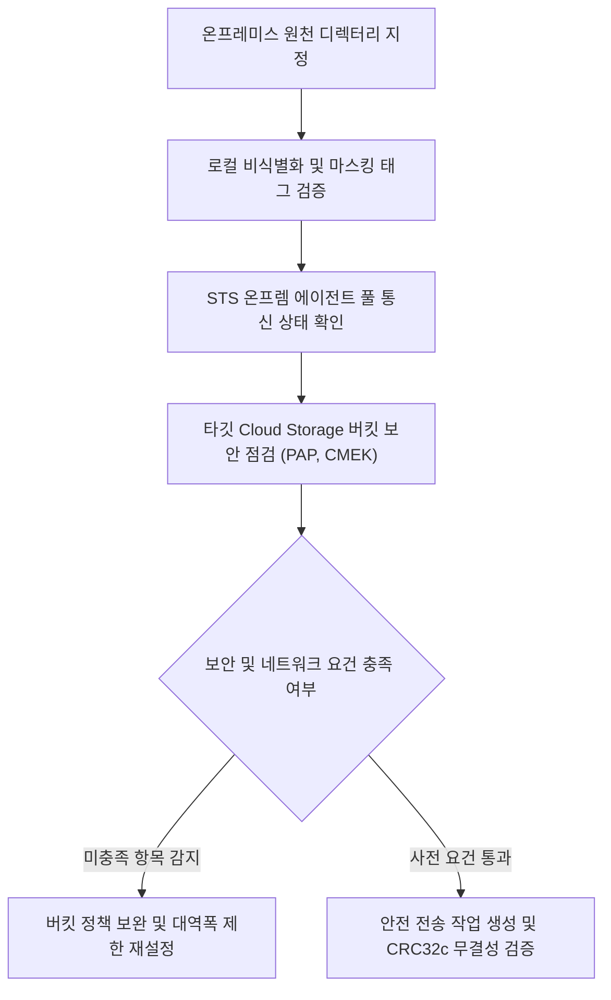

# 온프레미스 대용량 영상 STS 보안 전송 파이프라인 진단기

온프레미스 파일 서버에 보관된 대용량 영상(400GB 이상)을 Storage Transfer Service(STS)를 통해 Cloud KMS 암호화 및 무결성 검증을 거쳐 Cloud Storage로 안전하게 이관하는 진단 도구다. (As of 2026-09-09)

**Audience**: `#Architect`, `#SecOps`  
**Concern**: `#Compliance`, `#Performance`, `#Security`  
**Service**: `#CloudKMS`, `#CloudStorage`, `#StorageTransferService`

---

## 1. 이 가이드가 필요한 상황

- 현장 온프레미스 NAS/SAN 스토리지에 적재된 수백 기가바이트 이상의 영상 데이터를 Vertex AI 멀티모달 분석용으로 클라우드에 이전하고자 할 때
- 네트워크 대역폭 고갈을 방지하기 위해 정밀한 대역폭 제한(Bandwidth Throttling)을 적용하고 전송 에이전트 상태를 실시간 진단해야 하는 경우
- 국가 핵심 기술 및 기업 보안 규정에 맞추어 사전 비식별화, 전송 중 CRC32c 체크섬 검증, 타깃 버킷 Cloud KMS CMEK 이중 암호화, 공개 접근 차단(PAP)을 일괄 점검하고자 하는 경우

---

## 2. 진단 및 해결 흐름



---

## 3. 사전 준비 사항

본 도구를 실행하려면 최소 아래의 IAM 권한이 필요하다:

| 서비스 | 필요 역할(Role) | 최소 IAM 권한 |
| :--- | :--- | :--- |
| `Cloud Storage` | `roles/storage.admin` | `storage.buckets.get`, `storage.buckets.update` |
| `Storage Transfer Service` | `roles/storagetransfer.admin` | `storagetransfer.agentpools.list`, `storagetransfer.jobs.create` |

---

## 4. 1분 퀵스타트

### 가상 실행 (Dry-run)

실제 GCP API 호출이나 권한 없이도 모의 전송 사전 점검을 즉시 시뮬레이션할 수 있다:

```bash
./run.sh --dry-run
```

### 실제 환경 실행

```bash
# 기본 환경 변수 기준 실행
./run.sh

# 특정 버킷, 에이전트 풀 및 대역폭 제한(50MB/s) 지정 실행
./run.sh --project=my-secure-project --bucket=secure-media-archive --agent-pool=secure-posix-pool --bandwidth-limit=50
```

---

## 5. 결과 출력 예시

```text
=====================================================================================
온프레미스 대용량 미디어 STS 전송 및 보안 무결성 사전 진단 리포트
진단 모드: 가상 실행 (Dry-run)
대상 프로젝트: demo-secure-multimodal-transfer
타깃 버킷: gs://secure-media-archive
STS 에이전트 풀: on-prem-posix-pool
설정 대역폭 제한: 100 MB/s
=====================================================================================

[안전 전송 파이프라인 점검 현황]
-------------------------------------------------------------------------------------
단계                   점검 항목                          결과     상세 상태
-------------------------------------------------------------------------------------
1. 온프렘 로컬 전처리     영상 비식별화 및 개인식별정보/번호판 마스킹 PASS     142개 영상 파일(총 417GB) 전수 비식별화 메타데이터 태그 확인 완료
2. STS 에이전트 풀       에이전트 풀 상태 (on-prem-posix-pool) PASS     온프레미스 도커 에이전트 4대 정상 연결 (상태: CONNECTED, 버전: 최신)
3. 버킷 보안 통제        타깃 버킷 공개 접근 차단 (PAP)     PASS     gs://secure-media-archive publicAccessPrevention=enforced 적용됨
4. 데이터 암호화         Cloud KMS CMEK 암호화 적용         PASS     서울 리전(asia-northeast3) KMS 키 바인딩됨
5. 무결성 검증 설정      CRC32c / MD5 체크섬 검증           PASS     전송 중 손상 방지를 위한 청크 단위 CRC32c 해시 대조 자동 활성화
-------------------------------------------------------------------------------------

[전송 작업(Job) 생성 및 실행 가이드]
1. 온프레미스 에이전트 풀 생성 및 실행 토큰 발급:
   gcloud transfer agent-pools create on-prem-posix-pool --project=demo-secure-multimodal-transfer --display-name='Secure On-Prem Pool'
2. 타깃 버킷 공개 접근 차단 및 CMEK 강제:
   gcloud storage buckets update gs://secure-media-archive --public-access-prevention
   gcloud storage buckets update gs://secure-media-archive --default-kms-key=projects/demo-secure-multimodal-transfer/locations/asia-northeast3/keyRings/media-ring/cryptoKeys/video-key
3. 대역폭 제한(100 MB/s) 적용 온프렘-to-GCS 전송 작업 생성:
   gcloud transfer jobs create posix-to-gcs /mnt/on-prem/cctv gs://secure-media-archive/cctv-2026/ --source-agent-pool=on-prem-posix-pool --project=demo-secure-multimodal-transfer
=====================================================================================
```

---

## 6. 결과 확인 후 즉각 조치 가이드

1. **Storage Transfer Service 온프레미스 에이전트 관리**:
   - Storage Transfer Service > 온프레미스 ( https://console.cloud.google.com/transfer/on-premises )
   - 온프레미스 데이터 전송 개요 ( https://cloud.google.com/storage-transfer/docs/on-prem-overview )
   - 온프레미스 에이전트 풀 관리 ( https://cloud.google.com/storage-transfer/docs/on-prem-agent-pools )
2. **Cloud Storage 버킷 보안 강화**:
   - Cloud Storage > 버킷 브라우저 ( https://console.cloud.google.com/storage/browser )
   - 공개 접근 차단(PAP) 적용 ( https://cloud.google.com/storage/docs/public-access-prevention )

---

## 7. 자원 정리 (Teardown) 가이드

본 진단 도구는 전송 준비 상태를 검사하는 도구이며, 테스트용으로 생성한 전송 작업(Job)이나 에이전트 풀이 있다면 아래 명령어로 정리한다:

```bash
# 전송 작업 삭제
gcloud transfer jobs delete JOB_NAME --project=PROJECT_ID

# 온프레미스 에이전트 풀 삭제
gcloud transfer agent-pools delete AGENT_POOL --project=PROJECT_ID
```
