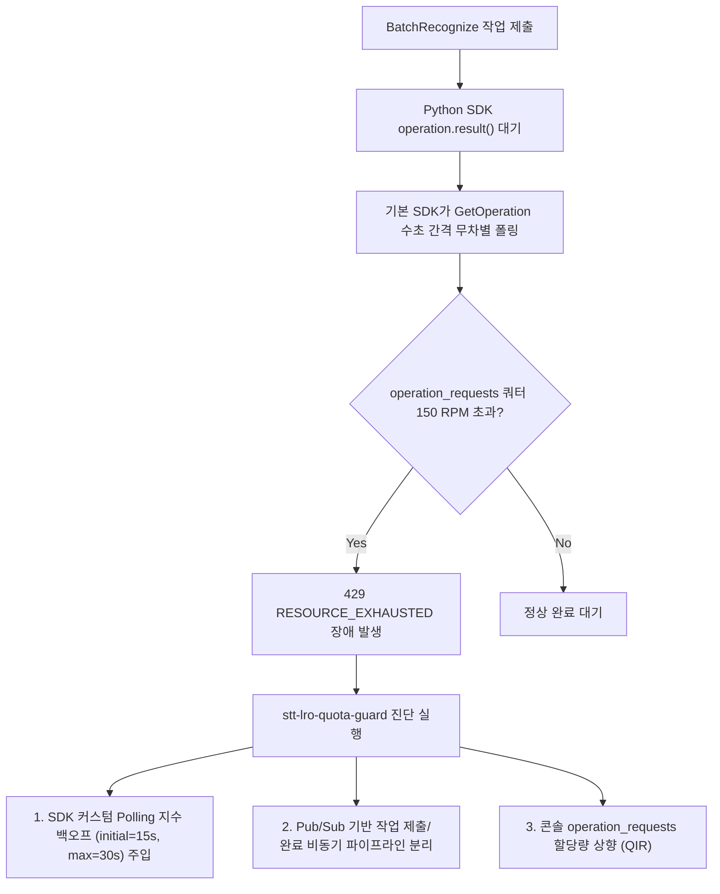

# Speech-to-Text V2 LRO 폴링 쿼터 고갈 및 429 장애 진단 도구

Cloud Speech-to-Text V2 비동기 배치 음성 인식(`BatchRecognize`) 파이프라인에서 대시보드상 요청 RPM이 정상임에도 발생하는 원인 불명의 `429 RESOURCE_EXHAUSTED` 장애를 진단하고, Python SDK 비동기 폴링(`google-api-core`) 지수 백오프 최적화 및 비동기 분리 아키텍처를 처방하는 도구다. (As of 2026-09-18)

**Audience**: `#Architect`, `#Developer`  
**Concern**: `#Performance`, `#Resilience`  
**Service**: `#CloudMonitoring`, `#SpeechToText`

---

## 1. 이 가이드가 필요한 상황 (증상 체크리스트)
- [ ] Speech-to-Text V2 (`BatchRecognize` 또는 `chirp_2`/`chirp_3` 모델) 호출 파이프라인에서 간헐적 또는 전면적으로 `429 RESOURCE_EXHAUSTED` 오류가 발생한다.
- [ ] Google Cloud 콘솔 할당량 대시보드에서 `BatchRecognize requests` 지표는 한도 대비 여유가 충분한데 장애가 지속된다.
- [ ] 파이썬 코드에서 `operation = client.batch_recognize(...)` 실행 후 `operation.result()`로 동기 블로킹 대기하고 있다.
- [ ] 다수의 워커 프로세스나 스레드가 동시에 음성 배치 작업을 제출하고 대기하면서 LRO 폴링 쿼터(`speech.googleapis.com/operation_requests`, 기본 150 RPM)를 소진하고 있다.

---

## 2. 진단 및 해결 흐름



---

## 3. 사전 준비 사항 및 필요 권한

본 도구 실행에는 Google Cloud 리소스 읽기 및 할당량 확인을 위한 최소 권한이 요구된다:

| 역할 (Role) | 설명 |
| :--- | :--- |
| `roles/monitoring.viewer` | Cloud Monitoring 지표 및 사용량 조회 권한 |
| `roles/serviceusage.serviceUsageViewer` | Speech-to-Text API 활성화 상태 및 기본 할당량 확인 권한 |

---

## 4. 1분 퀵스타트

### 가상 모의 실행 (Dry-run)
실제 GCP API 호출 없이 동시 작업 수에 따른 LRO 폴링 쿼터 고갈 위험도를 시뮬레이션한다:
```bash
./run.sh --dry-run
```

### 사내 실측 진단 실행
현재 활성화된 프로젝트와 예상 동시성(Concurrency)을 입력하여 진단한다:
```bash
# 기본 활성 프로젝트 및 동시성 15건 점검
./run.sh -c 15

# 특정 프로젝트 및 리전 지정
./run.sh -p <대상_프로젝트_ID> -l us-central1 -c 20
```

---

## 5. 결과 확인 후 즉각 조치 가이드

1. **Python SDK 커스텀 Polling 설정 적용 (즉시 조치)**:
   기본 짧은 간격 폴링 대신 대용량 배치 처리에 적합한 지수 백오프 폴러를 주입하여 `GetOperation` 호출량을 85% 이상 절감한다:
   ```python
   from google.api_core import polling
   from google.cloud import speech_v2

   custom_polling = polling.DEFAULT_POLLING.with_delay(
       initial=15.0,
       maximum=30.0,
       multiplier=1.5,
   )
   result = operation.result(polling=custom_polling, timeout=3600)
   ```

2. **비동기 큐 분리 아키텍처 전환 (권장)**:
   - 클라이언트에서 `operation.result()` 블로킹 대기를 제거하고, `operation.operation.name`을 Cloud Tasks 또는 Pub/Sub에 발행 후 즉시 응답을 종료한다.
   - 단일 백그라운드 워커가 정기적으로 작업 상태를 일괄 점검하여 쿼터 소진을 원천 차단한다.

3. **필수 할당량 상향 요청 (QIR)**:
   - 콘솔 경로: IAM & Admin > Quotas ( https://console.cloud.google.com/iam-admin/quotas )
   - 서비스: `Cloud Speech-to-Text API`
   - 대상 지표: `speech.googleapis.com/operation_requests` (기본 150 RPM을 운영 트래픽에 맞추어 상향)

---

## 6. 자원 정리 가이드 (Teardown)
본 미니 프로젝트는 순수 진단 및 시뮬레이션 도구이므로 별도의 클라우드 인프라 자원을 생성하지 않으며, 추가 삭제 절차가 필요하지 않다.
