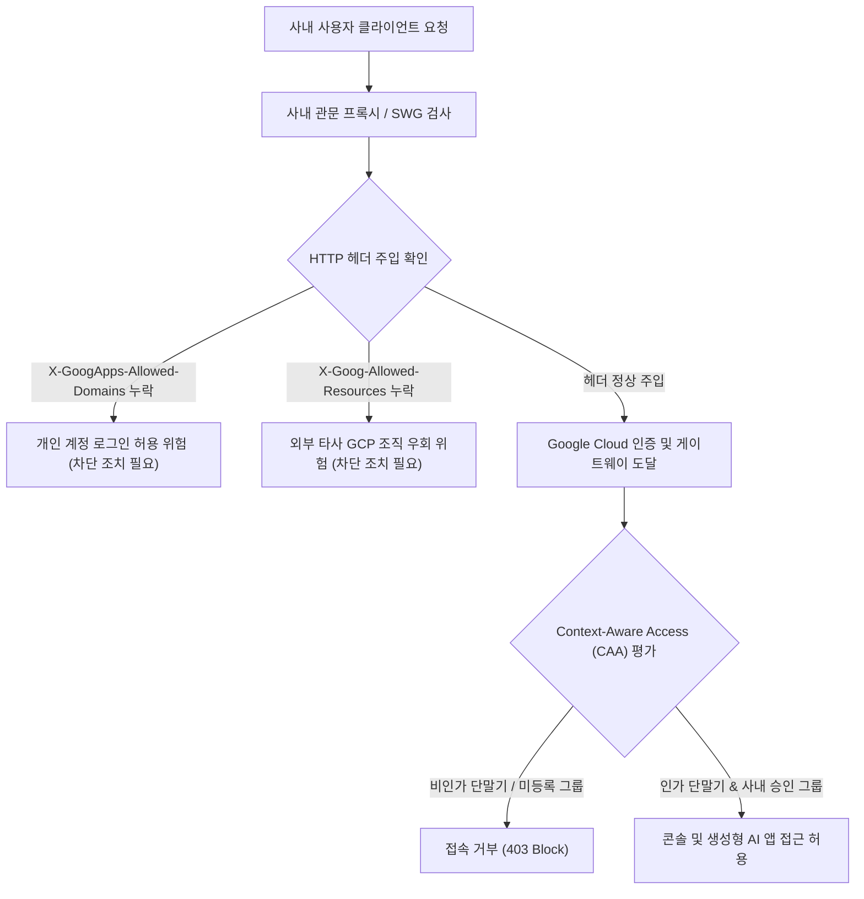

<!--
Copyright 2026 Google LLC. All Rights Reserved.
SPDX-License-Identifier: Apache-2.0

NOTICE: This code/repository is owned by Google LLC and provided under the Apache-2.0 License.
It is strictly provided as an EXAMPLE/REFERENCE ONLY and is NOT INTENDED FOR PRODUCTION USE.
All contents, designs, and code examples are subject to change, modification, or removal at any time without notice.

[고지 사항] 본 저장소 및 문서는 구글 (Google LLC) 소유이며 Apache 2.0 라이선스 하에 예시 (Sample) 용도로 제공된다.
프로덕션 환경용이 아니며, 사전 통지 없이 언제든지 수정, 변경 또는 삭제될 수 있다.
-->

> [!IMPORTANT]
> **구글 (Google LLC) 참조용 샘플 고지 사항**:
> 본 프로젝트의 모든 소스 코드와 문서는 Google LLC의 소유이며, Apache-2.0 라이선스에 따라 오직 **참조용 샘플 (Sample / Reference Only)** 목적으로만 제공된다. 프로덕션 환경에 그대로 사용할 수 없으며, 사전 통지 없이 언제든 내용이 수정, 변경 또는 삭제될 수 있다.

# 사내 관문 SWG 헤더 주입 및 Context-Aware Access 단말기 인가 진단

금융권 및 엔터프라이즈 환경에서 사내 관문 프록시(SWG)의 테넌트 제한 HTTP 헤더 주입 상태와 Context-Aware Access(CAA) 인가 단말기 접근 통제 정책을 종합 진단하여, 금융보안원 생성형 AI 보안대책 이행서 준수 및 외부 비인가 조직으로의 데이터 유출을 효과적으로 방어한다. (As of 2026-09-09)

**Audience**: `#Architect`, `#SecOps`  
**Concern**: `#Compliance`, `#Security`  
**Service**: `#CloudIdentity`, `#IAM`, `#VPC`  

---

## 1. 배경 및 문제 증상

금융권 및 엔터프라이즈 사내망에서 Google Cloud 콘솔 및 생성형 AI 애플리케이션(Gemini Enterprise 등)을 도입할 때, 금융보안원 '생성형 AI 보안대책 이행서' 3.2 항목(인가된 관리자 단말기 접속 통제)을 준수해야 한다.

- **개인 계정 로그인 유출**: 사내 단말기에서 개인 Gmail(`@gmail.com`) 또는 비인가 구글 계정으로 로그인하여 사내 데이터를 프롬프트로 전송하는 사고 위험.
- **외부 타사 GCP 조직 우회 접속**: 사내 승인 계정이라 할지라도 개인이 생성한 외부 GCP 프로젝트나 타사 테넌트로 접속하여 사내 자산을 반출하는 위험.
- **비인가 단말기 접근**: 사내 관리자 계정 탈취 시 외부 미인가 개인 PC나 모바일 기기에서 클라우드 콘솔에 접속하는 문제.

---

## 2. 진단 워크플로우



---

## 3. 사전 요구 사항 및 IAM 권한

본 도구를 실행하고 관련 정책을 조회 및 배포하기 위해 다음 역할이 필요하다:

- `roles/accesscontextmanager.policyReader` (또는 `roles/accesscontextmanager.policyAdmin`): Context-Aware Access 레벨 및 정책 조회/관리
- `roles/resourcemanager.organizationViewer`: 조직 리소스 및 계층 구조 확인
- 사내 관문 프록시(SWG, Forward Proxy) 설정 권한: 헤더 주입 룰 작성 및 배포

---

## 4. 원클릭 실행 및 검증

### (1) 가상 모의 진단 (`--dry-run`)
실제 프록시 호출 없이 권장 헤더 인코딩 및 CAA 정책 체크리스트를 사전 검증한다:
```bash
./run.sh --dry-run
```

### (2) 운영 환경 진단
환경 변수 또는 CLI 인자를 지정하여 실행한다:
```bash
./run.sh --org-id 123456789012 --domain example-corp.com --group-email gcp-authorized-users@example-corp.com
```

---

## 5. 단계별 조치 가이드

### 1단계: 사내 관문 프록시(SWG) HTTP 헤더 주입 구성
사내 아웃바운드 관문 장비(Squid, Envoy, Zscaler 등)에서 `*.google.com`, `*.googleapis.com` 대상 요청에 다음 헤더를 주입한다:
- **개인 계정 차단**:
  ```http
  X-GoogApps-Allowed-Domains: example-corp.com
  ```
- **외부 타사 GCP 테넌트 우회 차단 (Tenant Restriction)**:
  ```http
  X-Goog-Allowed-Resources: eyJyZXNvdXJjZXMiOlsib3JnYW5pemF0aW9ucy8xMjM0NTY3ODkwMTIiXSwib3B0aW9ucyI6InN0cmljdCJ9
  ```
  *(JSON 원문 `{"resources":["organizations/123456789012"],"options":"strict"}`의 base64url 인코딩 문자열)*

### 2단계: Context-Aware Access(CAA) 인가 단말기 바인딩
1. Google 관리 콘솔(Cloud Identity / Google Workspace) 접속 후 **보안 > 액세스 및 데이터 제어 > 상황 인식 액세스**로 이동한다.
2. Endpoint Verification을 통해 사내 관리 단말기(회사 소유, 암호화 상태, OS 최소 버전) 조건을 만족하는 액세스 레벨을 정의한다.
3. 대상 사용자 그룹(`gcp-authorized-users@example-corp.com`)에 해당 레벨을 적용하고 적용 앱으로 Google Cloud 콘솔 및 관련 서비스를 바인딩한다.

### 공식 가이드 및 콘솔 링크
- Organization Restrictions 개요 및 헤더 규격 ( https://docs.cloud.google.com/resource-manager/docs/organization-restrictions/overview )
- Google Workspace 개인 계정 로그인 차단 설정 ( https://support.google.com/a/answer/1668854 )
- Context-Aware Access 개요 및 장치 정책 ( https://docs.cloud.google.com/chrome-enterprise-premium/docs/overview )

---

## 6. 리소스 정리 (Teardown)

테스트 목적으로 생성한 Access Context Manager 임시 정책이나 모의 레벨을 삭제하려면 다음 명령을 수행한다:
```bash
gcloud access-context-manager levels delete CorpDeviceOnly --policy=<POLICY_ID> --quiet
```
사내 프록시에 적용한 테스트 헤더 주입 룰을 비활성화하고 프록시 설정을 리로드한다.
