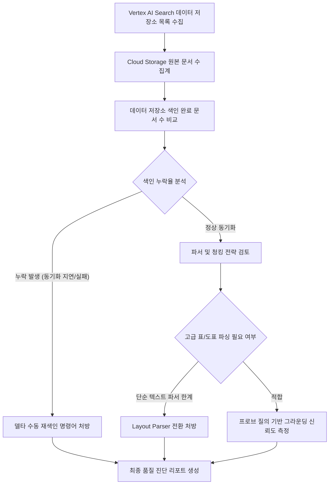

# Vertex AI Search 데이터 저장소 색인 및 그라운딩 정합성 진단기

Agent Platform 및 RAG 파이프라인에서 Cloud Storage 원본 문서와 Vertex AI Search 데이터 저장소(Data Store) 간의 색인 누락, 청킹(Chunking) 실패, 서비스 에이전트 권한 누락 및 Gemini 그라운딩 검색 품질 저하를 1분 만에 일괄 진단하고 처방하는 도구다.

**Audience**: `#Architect`, `#Developer`  
**Concern**: `#Performance`, `#Resilience`  
**Date**: `2026-09-09`  
**Service**: `#AgentPlatform`, `#CloudStorage`, `#GeminiAPI`, `#VertexAI`

---

## 1. 이 가이드가 필요한 상황

- Cloud Storage 버킷에 신규 문서나 개정된 사내 규정을 업로드했으나, Vertex AI Search 및 제미나이(Gemini) 모델 답변에 최신 내용이 반영되지 않는 경우
- 원본 스토리지 객체 수 대비 데이터 저장소에 실제 색인(Indexed) 완료된 문서 수가 현저히 부족하여 색인 누락율을 전수 파악해야 하는 경우
- 복잡한 표(Table), 다단 레이아웃, 스캔 PDF 파일이 단순 Digital Parser로 처리되어 검색 결과가 깨지거나 누락되는 경우
- Discovery Engine 서비스 에이전트(`gcp-sa-discoveryengine`)에 스토리지 읽기 권한(`roles/storage.objectViewer`)이 누락되어 색인 동기화가 차단된 경우
- Gemini 그라운딩 프로브 질의를 통해 검색 청크(Chunk) 품질과 신뢰도 점수(Grounding Score)를 사전 정량 평가하고자 하는 경우

---

## 2. 진단 및 해결 흐름



---

## 3. 사전 준비 사항

본 도구를 실행하려면 최소 아래의 IAM 권한이 필요하다:

| 서비스 | 필요 역할(Role) | 최소 IAM 권한 |
| :--- | :--- | :--- |
| `Discovery Engine` | `roles/discoveryengine.viewer` | `discoveryengine.dataStores.get`, `discoveryengine.documents.list` |
| `Cloud Storage` | `roles/storage.objectViewer` | `storage.buckets.get`, `storage.objects.get`, `storage.objects.list` |

---

## 4. 1분 퀵스타트

### 가상 실행 (Dry-run)

실제 GCP API 호출이나 권한 없이도 모의 RAG 파이프라인 시나리오를 즉시 시뮬레이션할 수 있다:

```bash
./run.sh --dry-run
```

### 실제 환경 실행

```bash
# 기본 프로젝트 및 글로벌 위치 기준 전체 데이터 저장소 점검
./run.sh

# 특정 프로젝트 및 특정 데이터 저장소 지정 실행
./run.sh --project=my-prod-project --location=global --datastore=enterprise-knowledge-ds

# 특정 버킷 및 테스트 프로브 질의어 지정 실행
./run.sh --project=my-prod-project --location=global --datastore=enterprise-knowledge-ds --bucket=my-enterprise-docs --query="2026 보안 가이드라인"
```

---

## 5. 결과 출력 예시

```text
================================================================================
Vertex AI Search 데이터 저장소 색인 및 그라운딩 정합성 진단 리포트
진단 모드: 가상 실행 (Dry-run)
대상 프로젝트: demo-vertex-search-project
위치(Location): global
점검 데이터 저장소 수: 2개
================================================================================

[1단계] 데이터 저장소별 원본 스토리지 동기화 및 색인율 점검
--------------------------------------------------------------------------------
저장소 ID                     원본 문서 수      색인 문서 수      동기화율       상태        
--------------------------------------------------------------------------------
enterprise-knowledge-ds    2400         1850         77.1%      WARNING   
customer-faq-ds            500          500          100.0%     OK        
--------------------------------------------------------------------------------

[2단계] 파서 구성, 청킹 전략 및 그라운딩 프로브 정밀 진단
--------------------------------------------------------------------------------
- 데이터 저장소: enterprise-knowledge-ds (전사 사내 규정 및 기술 문서)
  * 콘텐츠 유형: CONTENT_REQUIRED (비정형 문서)
  * 원본 버킷: gs://demo-enterprise-docs
  * 누락 문서 수: 550건
  * 적용 파서: DIGITAL_PARSER (단순 텍스트)
  * 청킹 단위: 500 토큰 (고정 크기)
  * 서비스 에이전트 IAM 권한: 정상 (roles/storage.objectViewer)
  * 프로브 질의: "2026 클라우드 보안 정책 가이드라인"
  * 검색 청크 수: 3개
  * 그라운딩 신뢰도 점수: 0.62 / 1.00
  * 진단 결과: [WARNING] GCS 원본 대비 550건(22.9%) 색인 누락 및 스캔 PDF 표/도표 파싱 불가로 그라운딩 신뢰도 저하 (레이아웃 파서 전환 및 재색인 필요)

- 데이터 저장소: customer-faq-ds (대고객 서비스 FAQ 저장소)
  * 콘텐츠 유형: CONTENT_REQUIRED (HTML/웹)
  * 원본 버킷: gs://demo-customer-faqs
  * 누락 문서 수: 0건
  * 적용 파서: HTML_PARSER
  * 청킹 단위: 250 토큰
  * 서비스 에이전트 IAM 권한: 정상 (roles/storage.objectViewer)
  * 프로브 질의: "서비스 환불 및 라이선스 이전 절차"
  * 검색 청크 수: 4개
  * 그라운딩 신뢰도 점수: 0.95 / 1.00
  * 진단 결과: [OK] 문서 색인율 100%, 고품질 청킹 및 우수한 그라운딩 정확도 확인

--------------------------------------------------------------------------------

[3단계] RAG 파이프라인 품질 개선 및 즉각 조치 처방
1. Cloud Storage 신규 및 누락 문서 수동 델타 재색인 트리거:
   gcloud discovery-engine documents import \
     --data-store=<DATASTORE_ID> \
     --location=global \
     --gcs-uri="gs://<BUCKET_NAME>/*" \
     --auto-generate-ids

2. 복합 표/다단 PDF 문서를 위한 Layout Parser(고급 레이아웃 파서) 활성화:
   - Agent Builder 콘솔 > Data Stores > Configurations > Document Processing
   - Parser 옵션을 'Digital Parser'에서 'Layout Parser(청킹 지원)'로 변경 후 재색인 수행

3. Discovery Engine 서비스 에이전트에 버킷 읽기 권한 보장:
   gcloud storage buckets add-iam-policy-binding gs://<BUCKET_NAME> \
     --member="serviceAccount:service-<PROJECT_NUMBER>@gcp-sa-discoveryengine.iam.gserviceaccount.com" \
     --role="roles/storage.objectViewer"
================================================================================
```

---

## 6. 결과 확인 후 즉각 조치 가이드

1. **데이터 저장소 수동 재색인 및 상태 모니터링**:
   - Agent Builder / Vertex AI Search 데이터 저장소 콘솔 ( https://console.cloud.google.com/gen-app-builder/data-stores ) > 대상 데이터 저장소 > 활동(Activity) 탭
   - 비정형 데이터 저장소 생성 및 관리 ( https://cloud.google.com/generative-ai-app-builder/docs/create-data-store-es )
2. **문서 청킹 및 Layout Parser 설정**:
   - 고품질 RAG 검색을 위해 복잡한 PDF 구조를 이해하는 Layout Parser와 적절한 청크 크기(200~500 토큰)를 설정한다.
   - 문서 파싱 및 청킹 가이드 ( https://cloud.google.com/generative-ai-app-builder/docs/parse-chunk-documents )
3. **제미나이(Gemini) 그라운딩 연동 최적화**:
   - 검색된 문서를 파운데이션 모델에 공급할 때 검색 점수 임계치(Dynamic Retrieval Threshold)를 설정하여 무관한 문서 인입을 차단한다.
   - Vertex AI Search를 활용한 Gemini 그라운딩 ( https://cloud.google.com/vertex-ai/generative-ai/docs/multimodal/ground-gemini )

---

## 7. 자원 정리 (Teardown) 가이드

본 진단 도구는 읽기 전용으로 데이터 저장소 메타데이터와 스토리지 색인 상태를 조회하므로 별도의 클라우드 인프라 자원을 생성하지 않는다. 실습용으로 생성한 테스트 데이터 저장소나 앱 엔진이 있다면 콘솔에서 삭제한다:

```bash
# 테스트 데이터 저장소 삭제 안내
# Agent Builder 콘솔 ( https://console.cloud.google.com/gen-app-builder/data-stores ) 에서 해당 저장소 선택 후 삭제(Delete)
```
